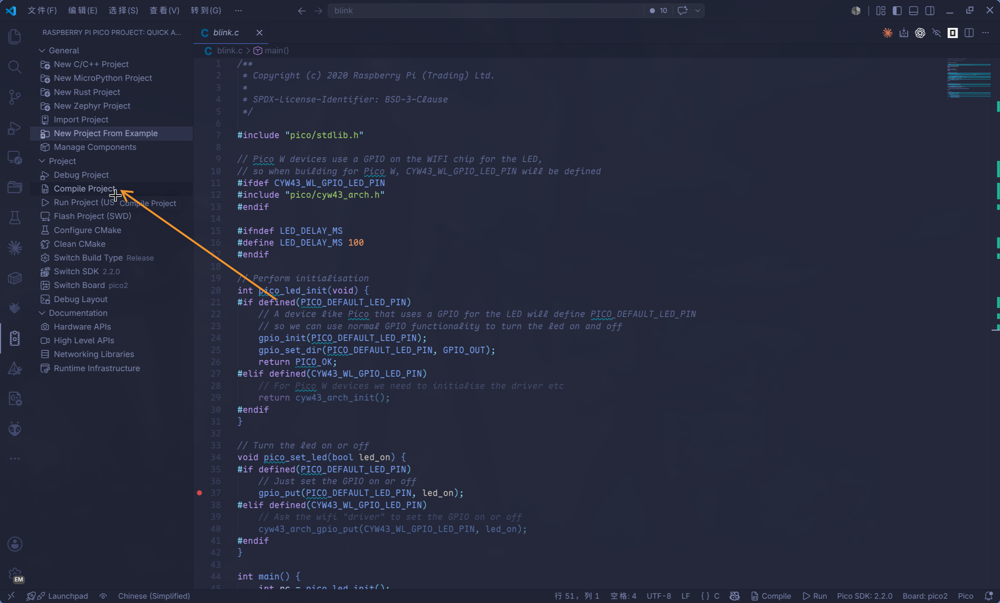

{{#title 为 Raspberry Pi Pico 2 搭建 C SDK 开发环境 | impl Rust for RP2350}}

# 安装环境说明

树莓派 Pico 在 Windows、macOS 和 Linux 上提供统一的开发体验，本书基于 Linux 平台完成开发工作。

# C SDK 环境说明

现在推荐的路线是：

1. 用官方 VS Code 插件安装和管理 SDK、工具链与工具组件。
2. 在 VS Code 内通过插件按钮编译、烧录、调试。
3. 在普通终端里也复用插件安装到 `~/.pico-sdk` 的同一套工具。

如果你想完全手动克隆 SDK、构建 picotool 和 OpenOCD，请看 [手动配置开发环境（可选）](./manual_setup.md)。

Rust 开发所需的 `rustup target`、`probe-rs`、Cargo runner 等内容放在 [Rust 环境](./rust_setup.md) 中。

## 插件已经安装了什么

安装 [Raspberry Pi Pico VS Code 插件](./pico_in_vscode.md) 并完成首次项目创建/导入后，工具通常位于：

```text
~/.pico-sdk/
├── sdk/              # Pico SDK
├── toolchain/        # ARM / RISC-V 裸机交叉编译器
├── cmake/            # 插件管理的 CMake
├── ninja/            # 插件管理的 Ninja
├── picotool/         # BOOTSEL / UF2 工具
├── openocd/          # Raspberry Pi 下游 OpenOCD
├── tools/            # pioasm 等 SDK 工具
├── examples/         # 插件示例缓存，未必是完整 pico-examples
└── cmake/pico-vscode.cmake
```

你可以先查看本机已经安装的版本：

```sh
find "$HOME/.pico-sdk" -maxdepth 2 -type d | sort
```

下面的命令以这组版本为例：

```text
sdk/2.2.0
toolchain/14_2_Rel1
toolchain/RISCV_ZCB_RPI_2_2_0_3
picotool/2.2.0-a4
cmake/v3.31.5
ninja/v1.12.1
openocd/0.12.0+dev
```

## 在终端中使用 ~/.pico-sdk

VS Code 插件生成的项目会在 `.vscode/settings.json` 中自动设置终端环境；如果你在普通终端里编译本书示例，可以手动导出下面这些变量：

```sh
export PICO_SDK_VERSION=2.2.0
export PICO_TOOLCHAIN_VERSION=14_2_Rel1
export PICOTOOL_VERSION=2.2.0-a4
export CMAKE_VERSION=v3.31.5
export NINJA_VERSION=v1.12.1
export OPENOCD_VERSION=0.12.0+dev

export PICO_SDK_PATH="$HOME/.pico-sdk/sdk/$PICO_SDK_VERSION"
export PICO_TOOLCHAIN_PATH="$HOME/.pico-sdk/toolchain/$PICO_TOOLCHAIN_VERSION"
export PICO_CMAKE="$HOME/.pico-sdk/cmake/$CMAKE_VERSION/bin/cmake"
export PICO_NINJA="$HOME/.pico-sdk/ninja/$NINJA_VERSION/ninja"
export PICO_OPENOCD="$HOME/.pico-sdk/openocd/$OPENOCD_VERSION/openocd"
export PICO_OPENOCD_SCRIPTS="$HOME/.pico-sdk/openocd/$OPENOCD_VERSION/scripts"

export picotool_DIR="$HOME/.pico-sdk/picotool/$PICOTOOL_VERSION/picotool"
export pioasm_DIR="$HOME/.pico-sdk/tools/$PICO_SDK_VERSION/pioasm"

export PATH="$PICO_TOOLCHAIN_PATH/bin:$picotool_DIR:$(dirname "$PICO_CMAKE"):$(dirname "$PICO_NINJA"):$(dirname "$PICO_OPENOCD"):$PATH"
```

建议把这段保存成你自己的 shell 片段，例如 `~/.config/pico-env.sh`，需要时执行，或者直接写入bashrc中也可以：

```sh
source ~/.config/pico-env.sh
```

> [!IMPORTANT]
> 这里的变量值要和 `~/.pico-sdk` 里的实际版本一致。插件更新 SDK 或工具链后，重新检查并更新这几个版本变量。

## 验证工具

检查 SDK：

```sh
test -f "$PICO_SDK_PATH/pico_sdk_init.cmake"
test -f "$PICO_SDK_PATH/external/pico_sdk_import.cmake"
```

检查 CMake 和 Ninja：

```sh
"$PICO_CMAKE" --version
"$PICO_NINJA" --version
```

检查 ARM 交叉编译器：

```sh
arm-none-eabi-gcc --version
arm-none-eabi-objcopy --version
```

检查 picotool：

```sh
picotool version
```

没有进入 BOOTSEL 模式时，下面这条命令提示找不到设备是正常的：

```sh
picotool info
```

检查 OpenOCD：

```sh
"$PICO_OPENOCD" --version
test -f "$PICO_OPENOCD_SCRIPTS/target/rp2350.cfg"
```

## 构建官方示例验证环境

插件可以通过 `Raspberry Pi Pico: New Example Pico Project` 创建示例项目。之前在vscode环境配置时候，已经建立过示例项目`blink`，直接cd过去

1. 使用插件命令进行构建
2. 终端中手动构建：

    ```sh
    "$PICO_CMAKE" -S . -B build -G Ninja \
        -DCMAKE_MAKE_PROGRAM="$PICO_NINJA" \
        -DPICO_BOARD=pico2 \
        -DPICO_SDK_PATH="$PICO_SDK_PATH" \
        -DPICO_TOOLCHAIN_PATH="$PICO_TOOLCHAIN_PATH" \
        -Dpicotool_DIR="$picotool_DIR" \
        -Dpioasm_DIR="$pioasm_DIR"
    ```

    构建 `blink`：

    ```sh
    "$PICO_CMAKE" --build build --target blink -j8
    ```


成功后会生成：

```text
build/blink/blink.elf
build/blink/blink.uf2
build/blink/blink.bin
```

`blink.uf2` 可以拖拽到 BOOTSEL 模式下出现的 `RP2350` 磁盘，也可以使用 `picotool` 烧录：

```sh
picotool load -u -v -x build/blink/blink.uf2
```

如果已经连接 Raspberry Pi Debug Probe，可以使用插件安装的 OpenOCD 烧录 ELF：

```sh
"$PICO_OPENOCD" -s "$PICO_OPENOCD_SCRIPTS" \
    -f interface/cmsis-dap.cfg \
    -f target/rp2350.cfg \
    -c "adapter speed 5000" \
    -c "program build/blink/blink.elf verify reset exit"
```

成功时会看到：

```text
** Programming Finished **
** Verify Started **
** Verified OK **
** Resetting Target **
```


## 配置 udev 规则

Linux 上如果 `picotool` 或 OpenOCD 提示权限不足，使用sudo有嫌弃需要输入密码。

那可以安装 udev 规则。

>插件安装的预编译 `picotool` 目录里不一定带规则文件，所以可以从对应官方仓库获取，或者按 [手动配置开发环境（可选）](./manual_setup.md) 先克隆源码后安装规则。

安装后一般还需要重新插拔 Pico / Debug Probe。如果修改了用户组，需要重新登录或重启。


## 常见问题

### SDK location was not specified

错误示例：

```text
SDK location was not specified. Please set PICO_SDK_PATH
```

解决方式：

```sh
export PICO_SDK_PATH="$HOME/.pico-sdk/sdk/2.2.0"
```

或者给 CMake 显式传参：

```sh
"$PICO_CMAKE" -S . -B build \
    -DPICO_SDK_PATH="$HOME/.pico-sdk/sdk/2.2.0"
```

### Compiler arm-none-eabi-gcc not found

先确认工具链路径和 `PATH`：

```sh
echo "$PICO_TOOLCHAIN_PATH"
which arm-none-eabi-gcc
```

如果 `which` 找不到，重新执行本章的环境变量片段。

### No installed picotool found

如果 CMake 配置时提示找不到 `picotoolConfig.cmake`，请显式传入插件安装的 package 路径：

```sh
-Dpicotool_DIR="$HOME/.pico-sdk/picotool/2.2.0-a4/picotool"
```

这个目录里应该包含：

```text
picotoolConfig.cmake
picotoolConfigVersion.cmake
```

### No accessible RP-series devices

错误示例：

```text
No accessible RP-series devices in BOOTSEL mode were found.
```

通常说明 Pico 没有进入 BOOTSEL 模式，或者 udev 规则没有对当前设备生效。按住 BOOTSEL 插入 USB，并重新插拔设备。如果刚刚修改过用户组，先重新登录。

### Failed to initialise libUSB

如果在容器、远程沙箱或受限环境中运行 `picotool`，可能会看到：

```text
ERROR: Failed to initialise libUSB
```

这通常不是 Pico SDK 安装问题，而是当前运行环境没有 USB 设备访问权限。请在普通终端中再次运行 `picotool info` 确认。

### OpenOCD 找不到 target/rp2350.cfg

使用插件安装的 OpenOCD 时，建议显式传入脚本根目录：

```sh
"$PICO_OPENOCD" -s "$PICO_OPENOCD_SCRIPTS" \
    -f interface/cmsis-dap.cfg \
    -f target/rp2350.cfg \
    -c "adapter speed 5000" \
    -c "init; exit"
```

如果直接运行系统里的 `openocd`，它可能没有 RP2350 支持。优先使用 `~/.pico-sdk/openocd/.../openocd`，或者按手动章节构建 Raspberry Pi 下游分支。
