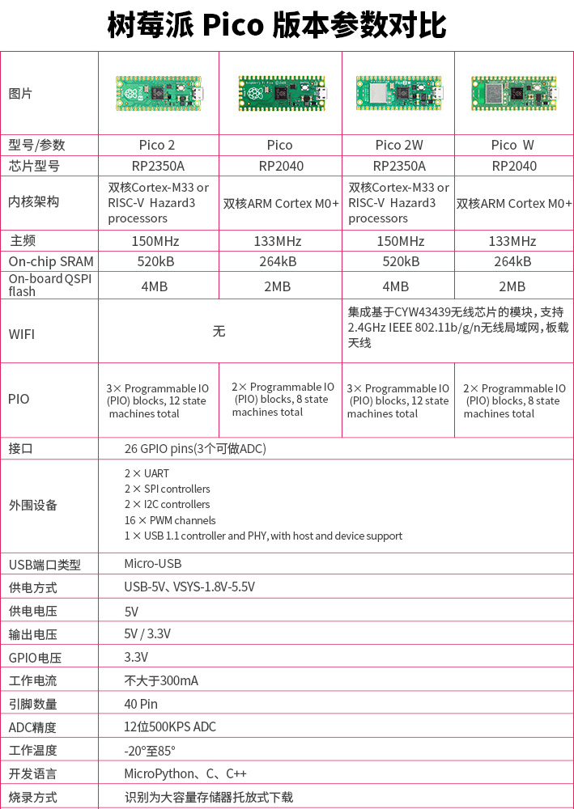

## 2W和2的区别

Pico 2 W 并不是只在 Pico 2 上“多焊了一个 Wi-Fi/蓝牙模块”。它的排针位置和大部分可用 GPIO 与 Pico 2 保持兼容，但板载 LED、电源状态检测、电源模式控制，以及部分内部 GPIO 的用途都发生了变化。下面每个差异点都标出了官方资料中提到的位置，方便你继续核对。

| 差异点 | Pico 2 | Pico 2 W | 为什么重要 | 出处 |
|---|---|---|---|---|
| 无线芯片和天线 | 没有板载无线接口 | 板载 Infineon CYW43439，支持 2.4 GHz Wi-Fi 4、Bluetooth 5.2，并使用板载天线 | Pico 2 W 可以直接做无线项目；天线区域附近不要放金属或其他会影响天线的结构 | [Pico 2 W Datasheet][pico2w-datasheet]：Chapter 1 “About Pico 2 W”、Chapter 2 “Mechanical specification”、Chapter 3.8 “Wireless interface” |
| 板载 LED | 用户 LED 连接到 RP2350 的 **GPIO25** | 用户 LED 连接到无线芯片的 **WL_GPIO0** | Pico 2 上可以直接控制 GPIO25 点亮板载 LED；Pico 2 W 上不能把 GPIO25 当作板载 LED 使用，需要通过 CYW43/WL_GPIO 控制 | [Pico 2 Datasheet][pico2-datasheet]：Chapter 3.1 “Raspberry Pi Pico 2 pinout”；[Pico 2 W Datasheet][pico2w-datasheet]：Chapter 2.1 “Pico 2 W pinout”；[pico-sdk `pico2.h`][pico-sdk-pico2] 中 `PICO_DEFAULT_LED_PIN`；[pico-sdk `pico2_w.h`][pico-sdk-pico2w] 中 `CYW43_WL_GPIO_LED_PIN` |
| VBUS 检测 | **GPIO24** 用于检测 USB VBUS 是否存在 | **WL_GPIO2** 用于检测 USB VBUS 是否存在 | 如果程序要判断当前是否 USB 供电，Pico 2 和 Pico 2 W 的读取方式不同 | [Pico 2 Datasheet][pico2-datasheet]：Chapter 3.1；[Pico 2 W Datasheet][pico2w-datasheet]：Chapter 2.1、Chapter 3.8；[pico-sdk `pico2.h`][pico-sdk-pico2] 中 `PICO_VBUS_PIN`；[pico-sdk `pico2_w.h`][pico-sdk-pico2w] 中 `CYW43_WL_GPIO_VBUS_PIN` |
| SMPS Power Save 控制 | **GPIO23** 控制板载 SMPS 的 Power Save 引脚 | **WL_GPIO1** 控制板载 SMPS 的 Power Save 引脚 | 如果为了降低 ADC 噪声而切换 SMPS 模式，Pico 2 直接控制 GPIO23；Pico 2 W 需要通过无线芯片 GPIO 控制 | [Pico 2 Datasheet][pico2-datasheet]：Chapter 3.1、Chapter 5.4 “Powerchain”；[Pico 2 W Datasheet][pico2w-datasheet]：Chapter 2.1、Chapter 3.3 “Using the ADC”、Chapter 3.4 “Powerchain”；[pico-sdk `pico2.h`][pico-sdk-pico2] 中 `PICO_SMPS_MODE_PIN`；[pico-sdk `pico2_w.h`][pico-sdk-pico2w] 中 `CYW43_WL_GPIO_SMPS_PIN` |
| RP2350 内部占用的 GPIO | GPIO23、GPIO24、GPIO25、GPIO29 分别用于 SMPS、VBUS、LED、VSYS/3 测量 | GPIO23、GPIO24、GPIO25、GPIO29 主要用于无线芯片接口：无线电源、SPI 数据/IRQ、SPI CS、SPI CLK/VSYS 测量 | 排针上仍然暴露 26 个 GPIO，但板内这些 GPIO 的默认职责不同；移植底层代码时要特别注意 | [Pico 2 Datasheet][pico2-datasheet]：Chapter 3.1；[Pico 2 W Datasheet][pico2w-datasheet]：Chapter 2.1；[pico-sdk `pico2_w.h`][pico-sdk-pico2w] 中 `CYW43_DEFAULT_PIN_WL_*` |
| VSYS 电压测量 | **GPIO29 / ADC3** 直接用于测量 VSYS/3 | **GPIO29 / ADC3** 与无线 SPI clock 复用，只适合在没有无线 SPI 事务时读取 | Pico 2 W 上测电池电压或 VSYS 时，要避开无线通信正在使用该引脚的时刻 | [Pico 2 Datasheet][pico2-datasheet]：Chapter 3.1；[Pico 2 W Datasheet][pico2w-datasheet]：Chapter 2.1、Chapter 3.4、Chapter 3.8；[pico-sdk `pico2_w.h`][pico-sdk-pico2w] 中 `CYW43_USES_VSYS_PIN` 和 `PICO_VSYS_PIN` |
| 机械布局和天线避让 | 51 mm x 21 mm x 1 mm，micro USB 位于顶部边缘 | 同样是 51 mm x 21 mm x 1 mm，但底边有板载无线天线，并要求天线区域不要被材料侵入 | 做外壳、底板或把 Pico 2 W 当作贴片模块使用时，要给天线留空间 | [Pico 2 Datasheet][pico2-datasheet]：Chapter 3 “Mechanical specification”；[Pico 2 W Datasheet][pico2w-datasheet]：Chapter 2 “Mechanical specification”、Chapter 3.8 |
| 推荐工作温度表 | Operating Temp Max 为 **85°C**（including self-heating），并建议环境温度最高 70°C | Operating Temp Max 为 **70°C**（including self-heating），并建议环境温度最高 70°C | 高温环境下，Pico 2 W 的无线芯片和整板热设计需要更保守 | [Pico 2 Datasheet][pico2-datasheet]：Chapter 3.3 “Recommended operating conditions”；[Pico 2 W Datasheet][pico2w-datasheet]：Chapter 2.3 “Recommended operating conditions” |
| 测试点 | 有 TP1 到 TP7，其中 TP7 是 1V1，不建议外部使用 | 有 TP1 到 TP6，没有 TP7；TP4/TP5 分别关联 WL_GPIO1/SMPS PS 和 WL_GPIO0/LED | 如果把 Pico 当作表贴模块，底部测试点用途不完全相同 | [Pico 2 Datasheet][pico2-datasheet]：Chapter 3.1；[Pico 2 W Datasheet][pico2w-datasheet]：Chapter 2.1 |
| 板载电源芯片 | Powerchain 图中使用 RT6150 buck-boost SMPS | Powerchain 图中使用 RT6154 buck-boost SMPS | 对普通接线来说，VBUS、VSYS、3V3_EN、3V3 的用法基本一致；但做更底层的电源分析时芯片型号不同 | [Pico 2 Datasheet][pico2-datasheet]：Chapter 5.4 “Powerchain”；[Pico 2 W Datasheet][pico2w-datasheet]：Chapter 3.4 “Powerchain” |

[pico2-datasheet]: https://datasheets.raspberrypi.com/pico/pico-2-datasheet.pdf
[pico2w-datasheet]: https://datasheets.raspberrypi.com/picow/pico-2-w-datasheet.pdf
[pico-sdk-pico2]: https://github.com/raspberrypi/pico-sdk/blob/master/src/boards/include/boards/pico2.h
[pico-sdk-pico2w]: https://github.com/raspberrypi/pico-sdk/blob/master/src/boards/include/boards/pico2_w.h

> [!NOTE]
> 后续的电源、GPIO、I2C、SPI、UART、SWD 等排针说明同时适用于 Pico 2 和 Pico 2 W。涉及板载 LED、VBUS/VSYS 读取、SMPS 模式控制时，以本节差异表为准。