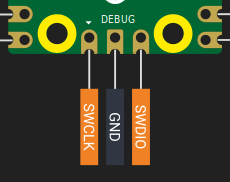
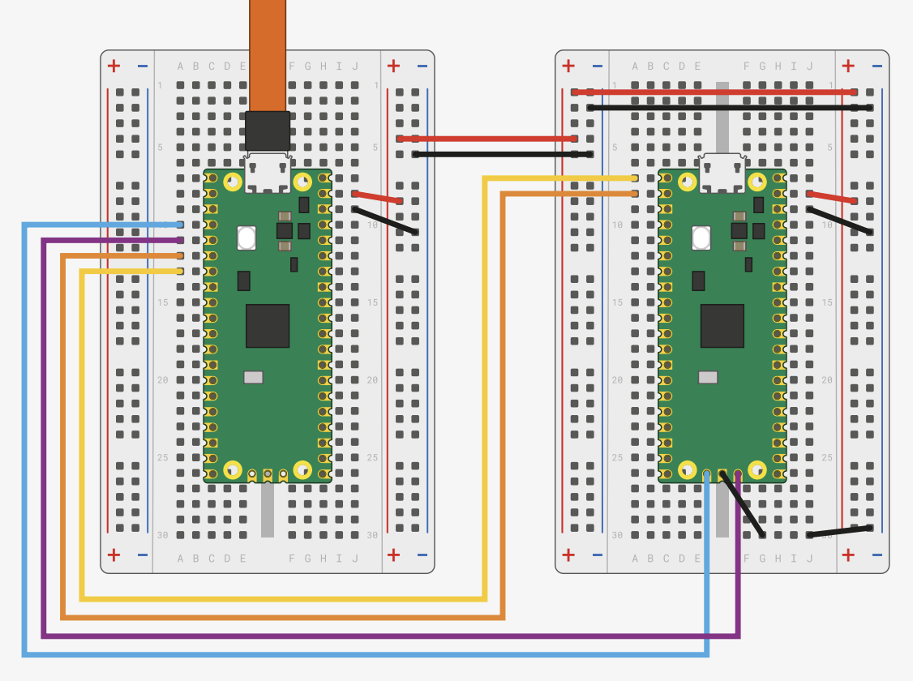

# Raspberry Pi Pico 2 的调试探针

Raspberry Pi Debug Probe 是官方推荐用于 Pico 和 Pico 2 上 SWD 调试的工具。它是一个小型 USB 设备，充当 CMSIS-DAP 适配器。CMSIS-DAP 是一种开放的调试器标准，它让你的电脑可以通过 SWD 协议与微控制器通信。

    
    
Credits: <a href="https://www.raspberrypi.com/documentation/microcontrollers/debug-probe.html">raspberrypi.com</a> - Debug Probe connected with Pico. 

这个探针提供两个主要功能：

1. **SWD（Serial Wire Debug）接口** - 它连接到 Pico 的调试引脚，用于烧录固件和进行实时调试。你可以像在普通桌面应用里一样设置断点、查看变量并调试程序。

2. **UART 桥接** - 它提供 USB 转串口连接，让你可以查看控制台输出或与开发板通信。

这两个功能都通过连接到电脑的同一根 USB 线工作，因此安装起来很简单，因为你不需要额外的 UART 设备。

## 焊接 SWD 引脚

在把 Debug Probe 连接到 Pico 2 之前，你需要先让 [SWD 引脚](../pico2-pinout.md#swd-debugging-pins)可用。这些引脚位于 Pico 板子的底边，在一个与主 GPIO 引脚分开的 3 针调试排针上。

    
    
SWD Debugging Pins

SWD 引脚焊好之后，你的 Pico 就可以连接到 Debug Probe 了。

## 准备 Debug Probe

你的 Debug Probe 可能不会预装最新固件，尤其是支持 Pico 2（RP2350 芯片）的版本。建议你在开始前先更新固件。

Raspberry Pi 官方文档提供了更新 Debug Probe 的清晰说明。请按照[这里的步骤](https://www.raspberrypi.com/documentation/microcontrollers/debug-probe.html#updating-the-firmware-on-the-debug-probe)操作。

## 将 Pico 与 Debug Probe 连接起来

Debug Probe 侧面有两个接口：

- **D 端口** - 用于 SWD（调试）连接
- **U 端口** - 用于 UART（串口）连接

### SWD 连接（必需）

SWD 连接负责让你烧录固件并使用调试器。请使用 Debug Probe 随附的 JST 转杜邦线。

将 Debug Probe D 端口上的导线按下面方式连接到 Pico 2 引脚：

| Probe Wire | Pico 2 Pin |
| ---------- | ---------- |
| Orange     | SWCLK      |
| Black      | GND        |
| Yellow     | SWDIO      |

在连接之前，请确认 Pico 2 的 SWD 引脚已经正确焊好。

### UART 连接（可选）

如果你想在电脑终端里看到串口输出，UART 连接就很有用。它与 SWD 连接是分开的。

将 Debug Probe U 端口上的导线连接到 Pico 2 引脚：

| Probe Wire | Pico 2 Pin       | Physical Pin Number |
| ---------- | ---------------- | ------------------- |
| Yellow     | GP0 (TX on Pico) | **Pin 1**           |
| Orange     | GP1 (RX on Pico) | **Pin 2**           |
| Black      | GND              | **Pin 3**           |

你也可以使用任何配置为 UART 的 GPIO 引脚，但 GP0 和 GP1 是 Pico 的默认 UART0 引脚。

### 给 Pico 供电

Debug Probe 不会给 Pico 2 供电，它只提供 SWD 和 UART 信号。要给 Pico 2 供电，请先通过 Debug Probe 的 USB 口把它连接到电脑，再通过 Pico 2 自己的 USB 连接单独供电。调试正常工作时，这两个设备都必须通电。

### 最终设置

连接完成后：

1. 将 Debug Probe 通过 USB 插到电脑上
2. 确保你的 Pico 2 已经通电
3. Debug Probe 的红色 LED 应该亮起，表示它已经供电
4. 你的环境已经准备好 - 从现在开始不需要再按 BOOTSEL 按钮了

现在你可以直接通过开发环境给 Pico 2 烧录和调试，不需要任何手动介入。

# 自己做一块？
本质上官方这个调试探针其实就是另一块 Pico 板子，如果你有另一块pico板子，也可以自己刷入**调试固件**，可以参考链接：
- [数据手册18~19页](https://pip-assets.raspberrypi.com/categories/610-raspberry-pi-pico/documents/RP-008276-DS-1-getting-started-with-pico.pdf)
- [Debug using a Pico-series device](https://www.raspberrypi.com/documentation/microcontrollers/pico-series.html#debug-using-a-pico-series-device)

