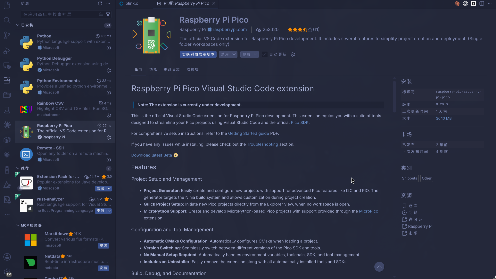
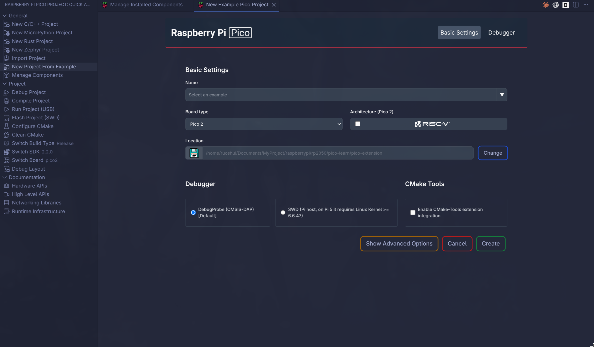
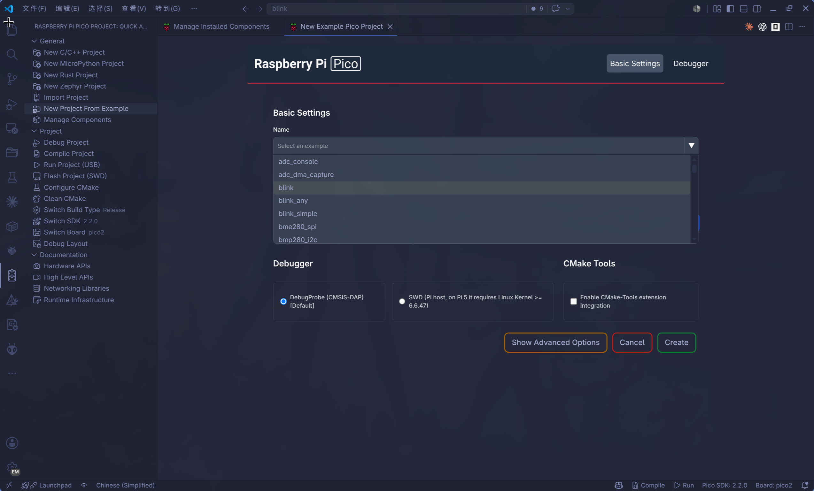

# 使用官方 Raspberry Pi Pico VS Code 插件

Raspberry Pi 官方提供了一个 VS Code 插件：[raspberrypi/pico-vscode](https://github.com/raspberrypi/pico-vscode)。官方的 [Getting started with Raspberry Pi Pico](https://datasheets.raspberrypi.com/pico/getting-started-with-pico.pdf) 也把它作为推荐入口之一：插件负责下载 Pico SDK、交叉编译器、CMake、Ninja、picotool、OpenOCD 等组件，并把 VS Code 的构建、烧录、调试配置串起来。

## 插件适合解决什么问题

传统手动配置 Pico C/C++ 环境时，需要分别处理：

- Pico SDK 仓库和子模块。
- ARM / RISC-V 裸机交叉编译器。
- CMake、Ninja、Python（*micropython*）、Git。
- `picotool` 与 `pioasm` 的 CMake package。
- 嵌入式调试工具包，如：Raspberry Pi 下游 `OpenOCD`。以及`probe-rs`等
- VS Code 的 `settings.json`、`tasks.json`、`launch.json`。

该插件默认将环境配置在~/.pico-sdk/，是为了考虑跨平台的[兼容性](https://github.com/raspberrypi/pico-vscode/issues/170)：

```text
~/.pico-sdk/
├── sdk/
├── toolchain/
├── cmake/
├── ninja/
├── picotool/
├── openocd/
├── tools/
├── examples/       # 插件示例缓存，未必是完整 pico-examples
└── cmake/pico-vscode.cmake
```

其中 `cmake/pico-vscode.cmake` 会把 `PICO_SDK_PATH`、`PICO_TOOLCHAIN_PATH`、`picotool_DIR`、`pioasm_DIR` 等变量指向插件安装的组件。

```shell
set(PICO_SDK_PATH "${USERHOME}/.pico-sdk/sdk/${sdkVersion}")
set(PICO_TOOLCHAIN_PATH "${USERHOME}/.pico-sdk/toolchain/${toolchainVersion}")

if (sdkVersion VERSION_LESS "2.0.0")
    if(WIN32)
        set(pico-sdk-tools_DIR "${USERHOME}/.pico-sdk/tools/${sdkVersion}")
        include(${pico-sdk-tools_DIR}/pico-sdk-tools-config.cmake)
        include(${pico-sdk-tools_DIR}/pico-sdk-tools-config-version.cmake)
    endif()
else()
    set(pioasm_HINT "${USERHOME}/.pico-sdk/tools/${sdkVersion}/pioasm")
    if(EXISTS ${pioasm_HINT})
        set(pioasm_DIR ${pioasm_HINT})
    endif()
    set(picotool_HINT "${USERHOME}/.pico-sdk/picotool/${picotoolVersion}/picotool")
    if(EXISTS ${picotool_HINT})
        set(picotool_DIR ${picotool_HINT})
    endif()
    if(PICO_TOOLCHAIN_PATH MATCHES "RISCV")
        set(PICO_PLATFORM rp2350-riscv CACHE STRING "Pico Platform")
        if(PICO_TOOLCHAIN_PATH MATCHES "RISCV_ZCB")
            set(PICO_COMPILER "pico_riscv_gcc_zcb_zcmp")
        endif()
    endif()
endif()
```

## 安装插件

在 VS Code 扩展市场搜索并安装：

```text
Raspberry Pi Pico
```

插件标识是：

```text
raspberry-pi.raspberry-pi-pico
```



安装后可以用左侧工作区打开插件页面：




除了安装插件，还需要系统里先安装一些基础工具。你可以详细看：https://github.com/raspberrypi/pico-vscode/blob/main/README.md

另外rust嵌入式开发这部分的环境都需要手动配置，你可以前往[rust_setup](./rust_setup.md)这一章节

安装完基础软件就可以创建项目，会自动安装好sdk和工具包：

## 创建 C/C++ 示例项目



常见选项可以这样选：

- Board：Pico 2 选 `pico2`，Pico 2 W 选 `pico2_w`。
- Toolchain：默认 C/C++ ARM 工具链；RISC-V 示例再选 RISC-V 工具链（可选作为验证）。
- Debugger: 使用默认的DebugProbe (CMSIS-DAP) 

生成后项目里通常会出现：

```text
my-pico-app/
├── CMakeLists.txt
├── pico_sdk_import.cmake
├── main.c
└── .vscode/
    ├── settings.json
    ├── tasks.json
    ├── launch.json
    └── cmake-kits.json
```

`CMakeLists.txt` 顶部会有一段插件管理块，类似：

```cmake
# == DO NOT EDIT THE FOLLOWING LINES for the Raspberry Pi Pico VS Code Extension to work ==
set(sdkVersion ...)
set(toolchainVersion ...)
set(picotoolVersion ...)
set(picoVscode ${USERHOME}/.pico-sdk/cmake/pico-vscode.cmake)
if (EXISTS ${picoVscode})
    include(${picoVscode})
endif()
# ====================================================================================
```

这段代码是插件用来锁定 SDK 和工具链版本的。一般不要手改它；切换 SDK 或开发板时，优先使用插件命令：

```text
Raspberry Pi Pico: Switch Pico SDK
Raspberry Pi Pico: Switch Board
```

## 编译、烧录和调试

插件会在状态栏和命令面板里提供常用动作：

- `Raspberry Pi Pico: Compile Pico Project`：编译当前项目。
- `Raspberry Pi Pico: Run Pico Project (USB)`：通过 USB / picotool 烧录运行。
- `Raspberry Pi Pico: Flash Pico Project (SWD)`：通过 Debug Probe / OpenOCD 烧录。
- `Raspberry Pi Pico: Conditional Debugging`：生成或打开调试配置。
- `Raspberry Pi Pico: Debug Layout`：切换到更适合调试的 VS Code 布局。

如果使用 `Run Pico Project (USB)`，板子通常需要处于 BOOTSEL 模式，或者程序已经启用了 SDK 的 USB reset 支持。最稳妥的方式仍然是：

1. 断开 Pico USB。
2. 按住 `BOOTSEL`。
3. 插入 USB。
4. 松开 `BOOTSEL`。
5. 在 VS Code 里运行 `Run Pico Project (USB)`。

如果使用 `Flash Pico Project (SWD)` 或调试功能，需要连接 Raspberry Pi Debug Probe，并确保 `SWDIO`、`SWCLK`、`GND` 接线正确。

## 常见问题

### 下载 SDK 或工具失败

插件需要访问 GitHub 下载 SDK、工具链和工具。如果提示版本获取失败或 GitHub API 限流，可以在 VS Code 设置里搜索 `raspberry-pi-pico.githubToken`，填入一个带 `public_repo` scope 的 classic PAT。

### CMake Tools 提示选择 Kit

如果启用了 CMake Tools integration，选择插件生成的 `Pico` kit。普通项目推荐继续使用 Raspberry Pi Pico 插件的编译、运行、调试按钮，CMake Tools 主要负责配置和索引。

### Linux 下 picotool 或 OpenOCD 权限错误

这通常不是 SDK 路径问题，而是 udev 规则或用户组没有生效。安装规则后需要重新插拔 Pico / Debug Probe；如果修改了用户组，通常还需要重新登录（注销再登录）。

### 安装ARM toolchain失败

Raspberry Pi Pico 插件安装 ARM toolchain 的逻辑比较简单：先根据所选 SDK 版本查 `versionBundles.json`，得到默认 toolchain 版本；再从 `supportedToolchains.ini` 里按当前平台选择下载地址；最后把压缩包下载到临时目录并解压到 `~/.pico-sdk/toolchain/<toolchainVersion>/`。

以插件 `0.20.0` 和 Pico SDK `2.2.0` 为例，默认 ARM toolchain 是：

```text
14_2_Rel1
```

Linux x86_64 对应的下载地址是：

```text
https://armkeil.blob.core.windows.net/developer/Files/downloads/gnu/14.2.rel1/binrel/arm-gnu-toolchain-14.2.rel1-x86_64-arm-none-eabi.tar.xz
```

插件内部的安装路径是：

```text
~/.pico-sdk/toolchain/14_2_Rel1/
```

需要注意的是，ARM toolchain 不是从 GitHub 下载的，而是从 Arm 的 `armkeil.blob.core.windows.net` 下载。因此 `raspberry-pi-pico.githubToken` 只能缓解 GitHub API 限流，对 ARM toolchain 下载失败没有直接帮助。国内网络、代理、TLS、下载中断都可能导致插件安装失败；插件也没有断点续传，失败时常见表现就是 VS Code 弹出 `Failed to download and install toolchain.`。

如果插件下载经常失败，可以手动安装到插件期望的目录：

```bash
mkdir -p ~/.pico-sdk/toolchain/14_2_Rel1

wget -O /tmp/arm-gnu-toolchain-14.2.rel1-x86_64-arm-none-eabi.tar.xz \
  https://armkeil.blob.core.windows.net/developer/Files/downloads/gnu/14.2.rel1/binrel/arm-gnu-toolchain-14.2.rel1-x86_64-arm-none-eabi.tar.xz

tar -xJf /tmp/arm-gnu-toolchain-14.2.rel1-x86_64-arm-none-eabi.tar.xz \
  -C ~/.pico-sdk/toolchain/14_2_Rel1 \
  --strip-components=1

~/.pico-sdk/toolchain/14_2_Rel1/bin/arm-none-eabi-gcc --version
```

如果是 Linux ARM64 主机，下载地址要换成：

```text
https://armkeil.blob.core.windows.net/developer/Files/downloads/gnu/14.2.rel1/binrel/arm-gnu-toolchain-14.2.rel1-aarch64-arm-none-eabi.tar.xz
```

插件判断“已安装”的条件也很宽松：只要 `~/.pico-sdk/toolchain/14_2_Rel1/` 存在并且目录非空，它就会跳过下载。因此如果上一次失败留下了不完整目录，插件可能误以为已经安装。遇到这种情况，先确认目录确实是坏的，再删除该版本目录后重新手动解压：

```bash
rm -rf ~/.pico-sdk/toolchain/14_2_Rel1
```

手动安装完成后，重新运行 `Raspberry Pi Pico: Switch Pico SDK` 或重新创建/导入项目，插件会复用这个目录。
