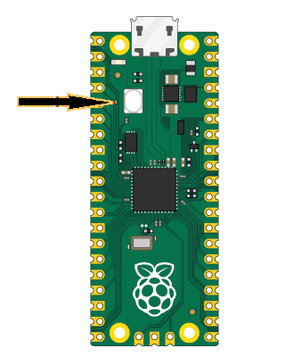
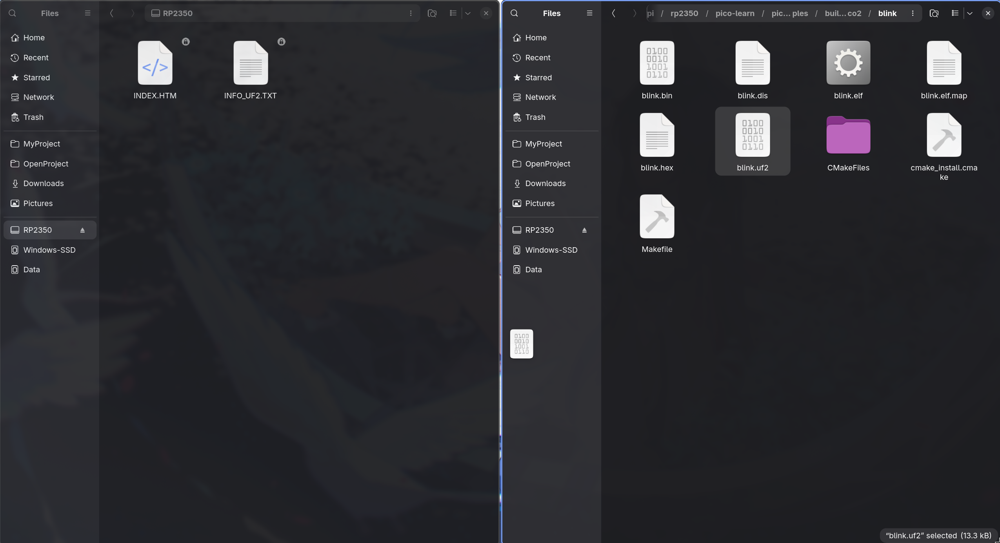

# 快速入门 for C

本章将引导你从零开始建立一个最小的 Pico 2 / Pico 2 W C 工程。我们会手动配置 CMake 构建系统和主程序，使你清楚地了解一个 Pico 项目的基本组成部分。完成本章后，你将拥有一个能够编译、烧录到开发板的完整工程。

## Pico 2 和 Pico 2 W 的差异

还记得在[引脚图](./pico2-pinout.md)中提及的吗？

> [!NOTE]
> Pico 2 和 Pico 2 W 都基于 RP2350，但它们的板载 LED 接法不同：
> - Pico 2 的闪灯代码非常直接，只需要配置 `PIN_25` 为输出引脚；
> - Pico 2 W 则必须先初始化 CYW43 芯片，再通过 CYW43 的 GPIO 控制 LED。

## 建立目录

前面已经装好了 Pico SDK，并且你的 shell 里已经有 `PICO_SDK_PATH` 环境变量：

```sh
echo "$PICO_SDK_PATH"
```

建立一个目录来放置工程文件：

```sh
mkdir pico2-manual-blink
cd pico2-manual-blink
touch CMakeLists.txt main.c
```

把 SDK 提供的导入脚本复制到当前项目：

```sh
cp "$PICO_SDK_PATH/external/pico_sdk_import.cmake" .
```

这个文件是一个 CMake 辅助脚本。它会根据 `PICO_SDK_PATH` 找到真正的 Pico SDK。

最终项目结构是：

```text
pico2-manual-blink/
├── CMakeLists.txt
├── main.c
└── pico_sdk_import.cmake
```

## 写 CMakeLists.txt 配置文件

新建 `CMakeLists.txt`，作为编译的配置文件：

```cmake
cmake_minimum_required(VERSION 3.13) 

include(pico_sdk_import.cmake)   # 导入 Pico SDK。

project(pico2_manual_blink C CXX ASM)  # Pico SDK 涉及 C、C++ 和汇编启动代码。

set(CMAKE_C_STANDARD 11)
set(CMAKE_CXX_STANDARD 17)

pico_sdk_init()                  # 初始化 SDK，准备板级配置、启动代码、链接脚本等。

add_executable(pico2_manual_blink  
    main.c
)                                #　声明我们要编译 `main.c`。

target_link_libraries(pico2_manual_blink
    pico_stdlib
)                                #  使用 GPIO、sleep、assert 等基础功能。

if (PICO_CYW43_SUPPORTED)
    target_link_libraries(pico2_manual_blink
        pico_cyw43_arch_none
    )
endif()                          #　只有 Pico 2 W 这类 CYW43 板子需要，用来控制无线芯片上的 LED

pico_add_extra_outputs(pico2_manual_blink)  #　生成烧录文件
```

## 写 main.c

新建 `main.c`：

```c
#include "pico/stdlib.h"

#if defined(CYW43_WL_GPIO_LED_PIN)
#include "pico/cyw43_arch.h"
#endif

#define LED_DELAY_MS 250

static int board_led_init(void) {
#if defined(PICO_DEFAULT_LED_PIN)
    gpio_init(PICO_DEFAULT_LED_PIN);
    gpio_set_dir(PICO_DEFAULT_LED_PIN, GPIO_OUT);
    return PICO_OK;
#elif defined(CYW43_WL_GPIO_LED_PIN)
    return cyw43_arch_init();
#else
#error "This board does not define a default LED pin."
#endif
}

static void board_led_put(bool on) {
#if defined(PICO_DEFAULT_LED_PIN)
    gpio_put(PICO_DEFAULT_LED_PIN, on);
#elif defined(CYW43_WL_GPIO_LED_PIN)
    cyw43_arch_gpio_put(CYW43_WL_GPIO_LED_PIN, on);
#endif
}


int main(void) {
    int rc = board_led_init();
    hard_assert(rc == PICO_OK);

    while (true) {
        board_led_put(true);
        sleep_ms(LED_DELAY_MS);

        board_led_put(false);
        sleep_ms(LED_DELAY_MS);
    }
}
```

这段代码同时兼容 Pico 2 和 Pico 2 W：

- Pico 2 的板载 LED 在 RP2350 的 `GPIO25` 上，SDK 会定义 `PICO_DEFAULT_LED_PIN`。
- Pico 2 W 的板载 LED 在 CYW43 无线芯片的 `WL_GPIO0` 上，SDK 会定义 `CYW43_WL_GPIO_LED_PIN`。

所以同一份 `main.c` 可以靠 `-DPICO_BOARD=...` 切换不同板子的构建方式。

## 编译 Pico 2

```sh
cmake -S . -B build-pico2 \
    -DPICO_BOARD=pico2

cmake --build build-pico2 -j
```

生成的 UF2 文件在：

```text
build-pico2/pico2_manual_blink.uf2
```

这里的 `-DPICO_BOARD=pico2` 会让 SDK 读取 Pico 2 的板级配置，所以 `PICO_DEFAULT_LED_PIN` 会被定义。

## 编译 Pico 2 W

```sh
cmake -S . -B build-pico2w \
    -DPICO_BOARD=pico2_w

cmake --build build-pico2w -j
```

生成的 UF2 文件在：

```text
build-pico2w/pico2_manual_blink.uf2
```

这里的 `-DPICO_BOARD=pico2_w` 会让 SDK 读取 Pico 2 W 的板级配置。Pico 2 W 的 LED 不在普通 GPIO 上，因此 `CMakeLists.txt` 里会额外链接 `pico_cyw43_arch_none`，`main.c` 里也会走 `cyw43_arch_gpio_put()`。

## 使用 BOOTSEL 运行

Pico 2 和 Pico 2 W 的 UF2 烧录方式相同：

步骤如下：

1. 断开 Pico 的 USB 连接。
2. 按住 `BOOTSEL` 按钮不放。
3. 保持按住按钮，用 USB 线把 Pico 接到电脑。
4. 电脑识别到 BOOTSEL 设备后，松开按钮。
5. 复制对应的 UF2 文件，或者直接在文件管理器里把 UF2 拖到 `RP2350` 盘中。



Pico 2：

```sh
cp build-pico2/pico2_manual_blink.uf2 /run/media/$USER/RP2350/
```

Pico 2 W：

```sh
cp build-pico2w/pico2_manual_blink.uf2 /run/media/$USER/RP2350/
```

如果你的系统挂载路径不是 `/run/media/$USER/RP2350/`，可以先用文件管理器或 `lsblk` 确认实际路径。

复制完成后，U 盘会自动断开，板子重启，板载 LED 开始闪烁。

另外你也可以直接把对应文件拖到 `RP2350` 盘里即可，不过能自动化是最好的：


## 使用 Debug Probe 烧录

如果你连接了 Debug Probe，就不需要按 `BOOTSEL`。目标板仍然需要通过 USB 或外部电源供电，并且 Debug Probe 的 `SWDIO`、`SWCLK`、`GND` 要和 Pico 正确连接。

先完成前面对应板型的编译，下面使用 `probe-rs` 作为示例。Pico 2：

```sh
probe-rs run --chip RP235x --protocol swd build-pico2/pico2_manual_blink.elf
```

Pico 2 W：

```sh
probe-rs run --chip RP235x --protocol swd build-pico2w/pico2_manual_blink.elf
```

烧录完成后，程序会自动运行，板载 LED 开始闪烁。

如果命令提示找不到 probe，通常需要检查 Debug Probe 的 USB 连接、SWD 接线，以及当前用户是否有访问调试器的权限。

## 自动化烧录

上面两种方式都可以写进 `CMakeLists.txt`，这样构建和烧录可以合成一条 `cmake --build` 命令。下面的内容追加到前面创建的项目根目录 `CMakeLists.txt` 末尾即可，也就是放在 `pico_add_extra_outputs(pico2_manual_blink)` 后面。

### 不使用 Debug Probe

这种方式仍然使用 `picotool`，所以运行命令前需要让 Pico 进入 `BOOTSEL` 模式。

在 `CMakeLists.txt` 中追加：

```cmake
add_custom_target(pico2_manual_blink_run
    COMMAND picotool load -u -v -x -t elf $<TARGET_FILE:pico2_manual_blink>
    DEPENDS pico2_manual_blink
    USES_TERMINAL
)
```

如果你已经配置过构建目录，改完 `CMakeLists.txt` 后先重新执行一次对应的配置命令。Pico 2：

```sh
cmake -S . -B build-pico2 \
    -DPICO_BOARD=pico2
```

Pico 2 W：

```sh
cmake -S . -B build-pico2w \
    -DPICO_BOARD=pico2_w
```

之后先按住 `BOOTSEL` 插入 USB，让电脑识别到 `RP2350` 设备，再运行对应命令。

Pico 2：

```sh
cmake --build build-pico2 --target pico2_manual_blink_run
```

Pico 2 W：

```sh
cmake --build build-pico2w --target pico2_manual_blink_run
```

如果看到类似下面的错误：

```text
No accessible RP-series devices in BOOTSEL mode were found.
```

通常说明板子当前没有进入 BOOTSEL 模式，或者系统的 udev 规则还没有对当前用户生效。先重新按住 `BOOTSEL` 插入 USB，再试一次。

### 使用 Debug Probe

这种方式使用 Debug Probe 通过 SWD 烧录，不需要进入 `BOOTSEL` 模式。

在 `CMakeLists.txt` 中追加：

```cmake
add_custom_target(pico2_manual_blink_probe
    COMMAND probe-rs run --chip RP235x --protocol swd $<TARGET_FILE:pico2_manual_blink>
    DEPENDS pico2_manual_blink
    USES_TERMINAL
)
```

同样地，如果你已经配置过构建目录，改完 `CMakeLists.txt` 后先重新执行一次对应的 `cmake -S . -B ...`（注意改成对应的命令） 配置命令。

然后连接好 Debug Probe，运行对应命令。

Pico 2：

```sh
cmake --build build-pico2 --target pico2_manual_blink_probe
```

Pico 2 W：

```sh
cmake --build build-pico2w --target pico2_manual_blink_probe
```

这个目标会先构建 `pico2_manual_blink`，再把生成的 ELF 文件交给 `probe-rs` 烧录并运行。
