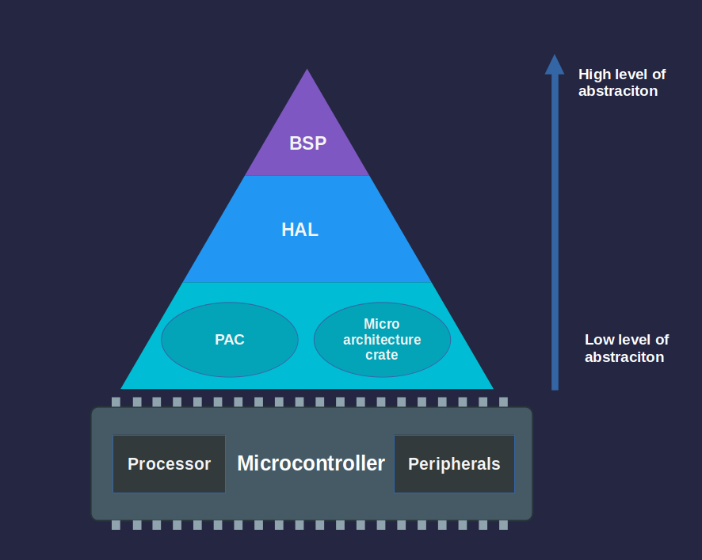

# 抽象层

开发嵌入式时候，会遇到诸如 PAC、HAL 和 BSP 之类的术语。这些层是解耦硬件交互的不同抽象层。每一层在灵活性与易用性之间提供不同的权衡。

我们从最高抽象层开始，逐层向下看。

## 板级支持包（BSP）

BSP，在 Rust 中常称为 Board Support Crate，针对特定开发板进行定制。它将 HAL 与板级配置组合在一起，为板载组件（如 LED、按钮和传感器）提供开箱可用的接口。这样开发者可以专注于应用逻辑，而不用处理底层硬件细节。由于目前没有一个专门且流行的针对 Raspberry Pi Pico 2 的 BSP，本书不会采用这种方式。

---

## 硬件抽象层（HAL）

HAL 位于 BSP 之下。如果你使用像 Raspberry Pi Pico 或基于 ESP32 的开发板，通常会主要在 HAL 层工作。HAL 通常是为具体芯片（例如 RP2350 或 ESP32）而不是单个板子编写的，这就是为什么相同的 HAL 可以在使用相同微控制器的不同板子之间复用。对于 Raspberry Pi 的微控制器系列，有提供硬件抽象的 `rp-hal` crate。

HAL 建立在 PAC 之上，为微控制器的外设提供更简单、更高层次的接口。与直接操作低级寄存器不同，HAL 提供的方法和 trait 使得设置定时器、配置串口（serial）通信或控制 GPIO 引脚等任务更容易完成。

微控制器的 HAL 通常会实现 `embedded-hal` 的 trait，`embedded-hal` 是针对 GPIO、SPI、I2C、UART 等外设的标准化、与平台无关的接口。这使得只要使用兼容的 HAL，就可以更容易地编写可在不同硬件间复用的驱动和库。

### RP 的 Embassy

Embassy 与 HAL 位于同一层，但它提供了带有异步能力（async）的运行时环境。Embassy（尤其是针对 Raspberry Pi Pico 的 `embassy-rp`）构建在 HAL 之上，提供异步执行器、定时器和额外的抽象，从而便于编写并发的嵌入式应用程序。

Embassy 提供了一个名为 `embassy-rp` 的专用 crate，用于 Raspberry Pi 的微控制器（RP2040 和 RP235x）。该 crate 直接构建在 `rp-pac`（Raspberry Pi Peripheral Access Crate）之上。

在本书中，我们将在不同练习中交替使用 `rp-hal` 和 `embassy-rp`。

---

> [!NOTE]
> HAL 之下的层通常很少直接使用。在大多数情况下，PAC 是通过 HAL 访问的，而不是单独直接使用。除非你使用的芯片没有可用的 HAL，否则通常不需要直接与更底层交互。在本书中，我们将把重点放在 HAL 层。

## 外设访问 Crate（PAC）

PAC 是最低级别的抽象层。它们是自动生成的 crate，提供对微控制器外设的类型安全访问。这些 crate 通常由厂商提供的 SVD（System View Description）文件使用 `svd2rust` 等工具生成。PAC 为你提供了一种结构化且安全的方式来直接与硬件寄存器交互。

## 原始 MMIO

原始 MMIO（memory-mapped IO）指直接通过读写特定内存地址来操作硬件寄存器。这种方法类似传统的 C 风格的寄存器操作，并且由于存在潜在风险，在 Rust 中需要使用 `unsafe` 块。我们不会触及这部分；我还没见过有人使用这种方法。
