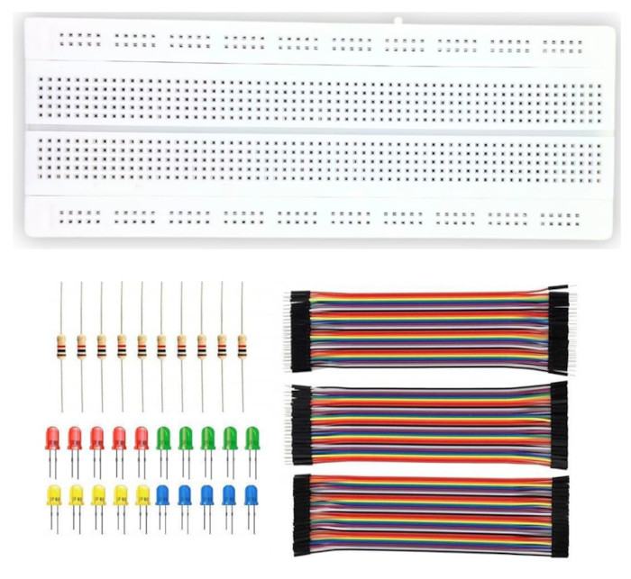

{{#title Additional Hardware for Raspberry Pi Pico 2 Projects | impl Rust for RP2350}}

# Additional Hardware

In this section we will look at some of the extra hardware you might use along with the Raspberry Pi Pico.

## Electronic kits

You can start with a basic electronics kit or buy components as you need them. A simple, low cost kit is enough to begin, as long as it includes resistors, jumper wires, and a breadboard. These are required throughout the lessons.

    
    
Basic Electronic Kit

Additional components used in this book include LEDs, the HC SR04 ultrasonic sensor, active and passive buzzers, the SG90 micro servo motor, an LDR, an NTC thermistor, the RC522 RFID reader, a micro SD card adapter, the HD44780 display, and a joystick module.

## Optional Hardware: Debug Probe

The Raspberry Pi Debug Probe makes flashing the Pico 2 much easier. Without it you must press the BOOTSEL button each time you want to upload new firmware. The probe also gives you proper debugging support, which is very helpful.

This tool is optional. You can follow the entire book without owning one (except the one specific to debug probe). When I first started with the Pico, I worked without a probe and only bought it later.

    
    
Raspberry Pi Pico Debug Probe

### How to decide?

If you are on a tight budget, you can skip it for now because its price is roughly twice the cost of a Pico 2. If the cost is not an issue, it is a good purchase and becomes very handy. You can also use another Pico as a low cost debug probe if you have a second board available.
