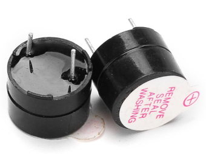
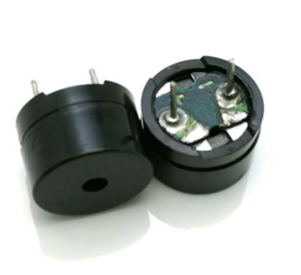

{{#title Buzzer Basics for Raspberry Pi Pico 2 | impl Rust for RP2350}}

# Buzzinga

In this section, we will explore some fun activities using a buzzer.  I chose the title Buzzinga just for fun (just playful reference to Sheldon's "Bazinga" from The Big Bang Theory). It is not a technical term.

## What is a Buzzer?

A buzzer is a small electronic component that produces sound when powered or driven by an electrical signal. It is used to generate beeps, alerts, or simple melodies, providing audible feedback in electronic systems.

Buzzers are commonly found in alarms, timers, notification systems, computers, and simple user interfaces, where they help confirm user actions or signal events.

## Common Types of Buzzers

There are two types you will commonly encounter in embedded projects:

### Active Buzzer

This type has a built-in oscillator. You only need to supply power, and it will start making sound immediately. Active buzzers are very easy to use but offer limited control over pitch.

#### How to identify

An active buzzer usually has a white covering on top and a smooth black casing at the bottom. The simplest way to identify it is to connect it directly to a battery. If it produces sound without any additional circuitry, it is an active buzzer.

### Passive Buzzer

A passive buzzer does not generate sound on its own. You must drive it using a PWM or square wave signal. This allows you to control the frequency, making it possible to generate different tones or even simple melodies.

#### How to identify

A passive buzzer typically has no white covering on top and often looks like a small PCB with a blue or green base. When connected directly to a battery, it will not produce any sound.

## Which One to Choose?

Choose an active buzzer if you only need a simple, fixed tone or beep. It works well for basic alerts, alarms, or confirming user input, and it requires minimal setup.

Choose a passive buzzer if you want more control over sound. Since it must be driven by a PWM or square-wave signal, you can generate different tones, melodies, or sound patterns.

For our exercises, a passive buzzer is recommended because it lets us control the output frequency directly (play better tone). However, if you only have an active buzzer, you can still follow along. In fact, I personally used an active buzzer at first for this.

## Hardware requirements

- Passive buzzer
- Jumper wires

A buzzer typically has two pins: a positive pin used for the signal and a ground pin. The positive side is often marked with a "+" symbol and is usually the longer pin, while the negative side is shorter, similar to an LED.

That said, some passive buzzers are non-polarized. In those cases, either pin can be connected to the signal or ground. Always check the markings or the datasheet if you are unsure.

## Reference

- [Pico official guide on buzzer](https://projects.raspberrypi.org/en/projects/introduction-to-the-pico/9)
