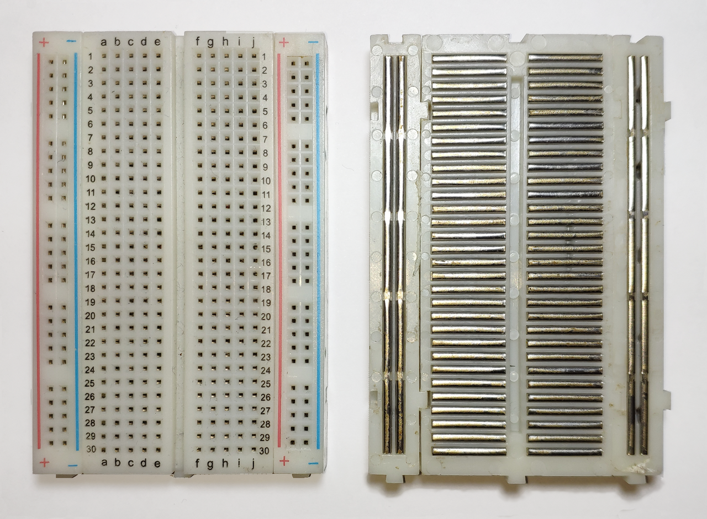

{{#title Breadboard Basics and Internal Connections | impl Rust for RP2350}}

# Breadboard

A breadboard is a small board that helps you build circuits without soldering. It has many holes where you can plug in wires and electronic parts. Inside the board, metal strips connect some of these holes. This makes it easy to join parts together and complete a circuit.

    
    
Image credit: <a href="https://commons.wikimedia.org/wiki/File:Breadboard.png">Wikimedia Commons</a>, License: CC BY-SA 3.0

The picture shows how the holes are connected inside the breadboard.

## Power rails

The long vertical lines on both sides are called power rails. People usually connect the power supply to the rail marked with "+" and the ground to the rail marked with "-". Each hole in a rail is connected from top to bottom.

Let's say you want to give power to many parts. You only need to connect your power source (for example, 3.3 V or 5 V) to one point on the "+" rail. After that, you can use any other hole on the same rail to power your components.

## Middle area

The middle part of the breadboard is where you place most of your components. The holes here are connected in small horizontal rows. Each row has five holes that are linked together inside the board.

As you can see in the image, each row is separate, and the groups marked as `a b c d e` are separated from the groups marked as `f g h i j`. The center gap divides these two sides, so the connections do not cross from one side to the other.

Here are some simple examples:

- If you plug a wire into 5a and another wire into 5c, they are connected because they are in the same row.
- If you plug one wire into 5a and another into 5f, they are `not` connected because they are on different sides of the gap.
- If you plug one wire into 5a and the other into 6a, they are `not` connected because they are in different rows.
