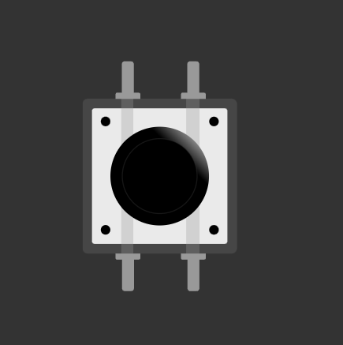
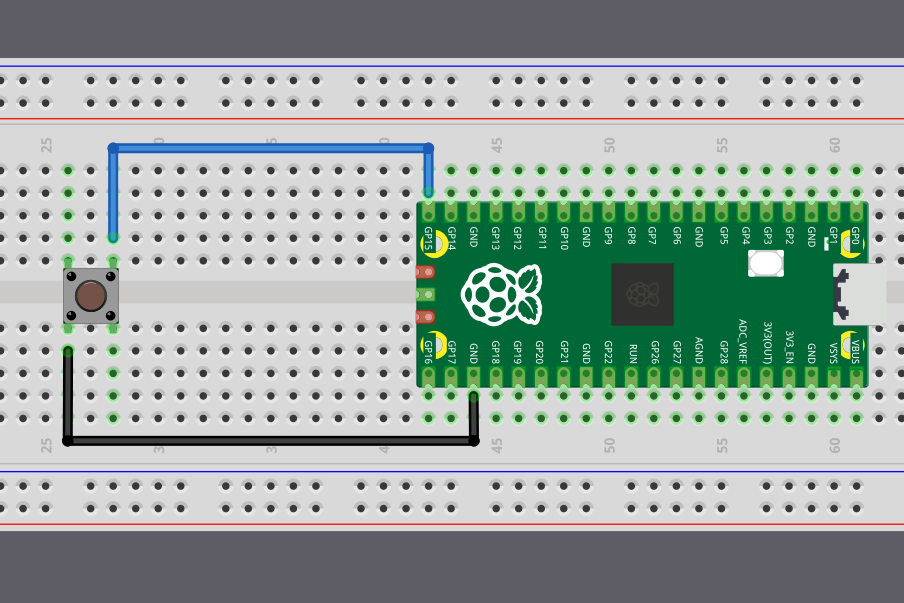

{{#title Reading Button Input on Raspberry Pi Pico 2 in Embedded Rust | impl Rust for RP2350}}

# Buttons

Now that we know how to blink an LED, let's learn how to read input from a button. This will let us interact with our Raspberry Pi Pico and make our programs respond to what we do.

    
    
Tactile Switch Buttons

A button is a small tactile switch. You will find these in most beginner electronic kits. When you press it, the two pins inside make contact and the circuit closes. When you release it, the pins separate and the circuit opens again. Your program can read this open or closed state and do something based on it.

## How a Tactile Button Works

A tactile button has four legs arranged in pairs. Looking at the button from above, the legs form a rectangle. The two legs on each side of the button are electrically connected together internally.

    
    
Inside Button

I will update this section later with a clearer diagram that shows the internal connections more explicitly. For now, this illustration is enough to understand the concept. The light line indicates that the pins on the left are connected to each other, and the same is true for the pins on the right. When the button is pressed, the left and right sides become connected.

## Connecting Buttons to the Pico

Connect one side of the button to Ground and the other side to a GPIO pin (for example, GPIO 15). When the button is pressed, both sides become connected internally, and the GPIO 15 pin gets pulled low. We can check if the pin is pulled low in our code and trigger actions based on it.

    
    
Button with Raspberry Pi Pico 2

Wait. What happens when the button is *not* pressed? What voltage or level is the GPIO pin reading now? For this to make sense logically, the pin should be in a High state so we can detect the Low state as a button press. But without anything else in the circuit, the GPIO pin will be in something called a *floating state*. This is unreliable, the pin can randomly switch between High and Low even when no button is pressed. How do we fix this? Let's see in the next section.
