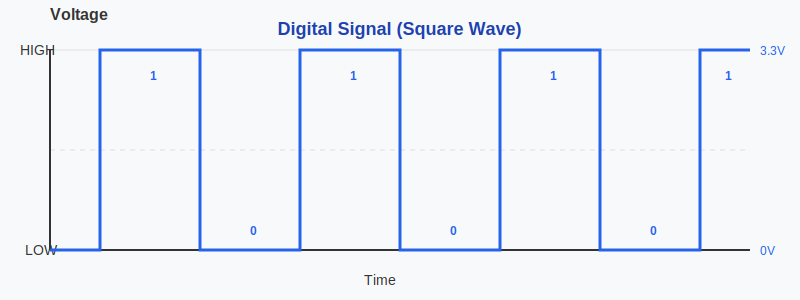
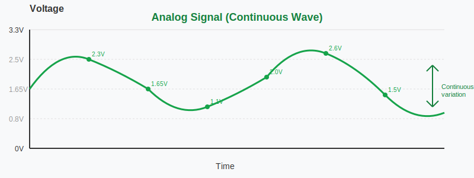

{{#title Pulse Width Modulation (PWM) Explained for Embedded Rust on Raspberry Pi Pico 2}}

# Pulse Width Modulation (PWM)

In this section, we will explore what is PWM and why we need it.

## Digital vs Analog

To understand PWM, we first need to understand what is digital and analog signal.

### Digital Signals

A digital signal has only two states: HIGH or LOW. In microcontrollers, HIGH typically means the full voltage (5 V or 3.3 V), and LOW means 0 V. There's nothing in between. Think of it like a light switch that can only be fully ON or fully OFF.

When you use a digital pin on your microcontroller, you can only output these two values. If you write HIGH to a pin, it outputs 3.3 V. If you write LOW, it outputs 0 V. You cannot tell a digital pin to output 1.5 V or 2.7 V or any value in between.

## Analog Signals

An analog signal can have any voltage value within a range. Instead of just ON or OFF, it varies continuously and smoothly. Think of it like a dimmer switch that can set brightness anywhere from completely off to fully bright, with infinite positions in between.

For example, an analog signal could be 0 V, 0.5 V, 1.5 V, 2.8 V, 3.1 V, or any other value within the allowed range. This smooth variation allows you to have precise control over devices.

## The Problem

Here's the challenge: most microcontroller pins are digital. They can only output HIGH or LOW. But what if you want to:

Dim an LED to 50 % brightness instead of just fully ON or fully OFF (like we did in the quick-start blinking example)? Or control a servo motor to any position between 0° and 180°? Or adjust the speed of a fan or control temperature gradually?

You need something that acts like an analog output, but you only have digital pins. This is where PWM comes in.
