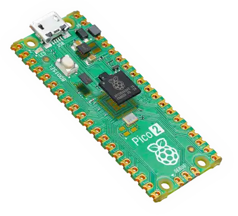

{{#title 在 Raspberry Pi Pico 2 / Pico 2 W 上开始学习 Rust 与 C | impl Rust & C for RP2350}}

# impl Rust & C for RP2350 - 简介

<strong>本书基于 <a href="https://github.com/ImplFerris/pico-pico" style="color: #e67e22;">ImplFerris/pico-pico</a> 原项目改编，在原作 Rust 嵌入式内容的基础上，新增了 C (Pico SDK) 实现作为对照。采用「同一个概念，C 和 Rust 两种写法」的编排方式，帮助自己在嵌入式学习中同时掌握两门语言。</strong>

## 硬件介绍 - Pico 2 & Pico 2 W

本书使用基于新型 RP2350 芯片的 Raspberry Pi Pico 2 和 Raspberry Pi Pico 2 W。它们提供双核灵活性，支持 ARM Cortex-M33 核心，并可选 Hazard3 RISC-V 核心。默认情况下，它们使用标准的 ARM 核心运行，但开发者如需要也可选择尝试 RISC-V 架构。

可以访问官方网站获取更多内容：[Pico 2](https://www.raspberrypi.com/products/raspberry-pi-pico-2/)

    
    
Raspberry Pi Pico 2

> [!NOTE]
> 源项目 https://github.com/ImplFerris/pico-pico 主要基于 Pico 2。本项目在此基础上继续扩展，示例同时支持 Pico 2 和 Pico 2 W。

Pico 2 W 支持 Wi-Fi 和蓝牙功能，同样基于 RP2350 芯片。对于普通 GPIO、PWM、ADC、I2C、SPI 等外设章节，Pico 2 和 Pico 2 W 的核心用法保持一致；涉及板载 LED、无线芯片或引脚差异的章节，会在内容中给出对应说明。

## 数据手册

如需查看详细的技术信息、规格参数和设计指南，可以参考官方数据手册：

- [Pico 2 数据手册](https://datasheets.raspberrypi.com/pico/pico-2-datasheet.pdf)
- [Pico 2 W 数据手册](https://pip-assets.raspberrypi.com/categories/1088-raspberry-pi-pico-2-w/documents/RP-008304-DS-2-pico-2-w-datasheet.pdf)
- [RP2350 芯片数据手册](https://datasheets.raspberrypi.com/rp2350/rp2350-datasheet.pdf)

## 许可证

《impl Rust & C for RP2350》（本项目）采用以下许可证发布：

* 本书中的代码示例和独立 Cargo 项目同时采用 [MIT License] 和 [Apache License v2.0] 授权。
* 本书中的文字内容采用 Creative Commons [CC-BY-SA v4.0] 许可证授权。
* 本书中的电路图使用 Fritzing 绘制。

[MIT License]: https://opensource.org/licenses/MIT
[Apache License v2.0]: http://www.apache.org/licenses/LICENSE-2.0
[CC-BY-SA v4.0]: https://creativecommons.org/licenses/by-sa/4.0/legalcode
