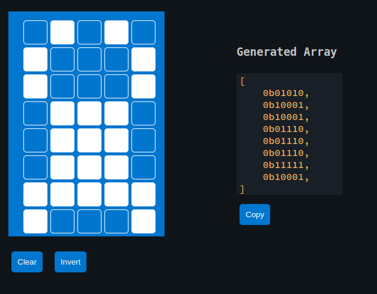

{{#title Custom Characters on LCD Display with Embassy on Raspberry Pi Pico 2}}

# Ferris on LCD Display

In this section, we will draw Ferris on a character LCD. This is my attempt at making it look like a crab. If you come up with a better design, feel free to send a pull request.

Although a single custom character is limited to one 5x8 cell, we are not restricted to just one cell. By combining 4 or even 6 adjacent grids, we can display a larger symbol. How far you take this is entirely up to your creativity.

We will use the custom glyph generator from the previous page to design Ferris. The generator produces the byte array that we can directly use in our code.



## liquid_crystal crate

The hd44780-driver crate that we used earlier does not support defining custom glyphs. To work with custom glyphs stored in CGRAM, we will use the `liquid_crystal` crate.

This crate supports custom glyphs and also provides an async API, which we will use in this chapter.

### Update Cargo.toml

Enable the async feature when adding the dependency:

```toml
liquid_crystal = { version = "0.2.0", features = ["async"] }
```

## Additional imports

Add these imports at the top of your main.rs:

```rust
// Interrupt Binding
use embassy_rp::peripherals::I2C0;
use embassy_rp::{bind_interrupts, i2c};

// I2C
use embassy_rp::i2c::{Config as I2cConfig, I2c};

// LCD Driver
use liquid_crystal::I2C;
use liquid_crystal::LiquidCrystal;
use liquid_crystal::prelude::*;

use embassy_time::Delay;
```

## Bind I2C Interrupt

Bind the `I2C0_IRQ` interrupt to the Embassy I2C interrupt handler for `I2C0`:

```rust
bind_interrupts!(struct Irqs {
    I2C0_IRQ => i2c::InterruptHandler<I2C0>;
});
```

## Initialize I2C

First, set up the I2C bus to communicate with the display:

```rust
let sda = p.PIN_16;
let scl = p.PIN_17;

let mut i2c_config = I2cConfig::default();
i2c_config.frequency = 100_000; // 100kHz

let i2c_bus = I2c::new_async(p.I2C0, scl, sda, Irqs, i2c_config);
```

## Initialize the LCD interface

Once the I2C interface is set up, we initialize the LCD.

```rust
// LCD Init
let mut i2c_interface = I2C::new(i2c_bus, 0x27);
let mut lcd = LiquidCrystal::new(&mut i2c_interface, Bus4Bits, LCD16X2);
lcd.begin(&mut Delay);
```

## Generated byte array for the custom glyph

```rust
const FERRIS: [u8; 8] = [
    0b01010, 0b10001, 0b10001, 0b01110, 0b01110, 0b01110, 0b11111, 0b10001,
];
// Define the character
lcd.custom_char(&mut Delay, &FERRIS, 0);
```

## Displaying

Displaying the character is straightforward. You just need to use the CustomChar enum and pass the index of the custom character. We've defined only one custom character, which is at position 0.

```rust
lcd.write(&mut Delay, CustomChar(0));
lcd.write(&mut Delay, Text(" implRust!"));
```

## Clone the existing project

You can clone (or refer) project I created and navigate to the `custom-glyph` folder.

```sh
git clone https://github.com/ImplFerris/pico2-embassy-projects
cd pico2-embassy-projects/lcd/custom-glyph/
```

## rp-hal version

You can clone (or refer) project I created and navigate to the `custom-glyph` folder.

```sh
git clone https://github.com/ImplFerris/pico2-rp-projects
cd pico2-projects/lcd/custom-glyph/
```

## The Full code

```rust
#![no_std]
#![no_main]

use embassy_executor::Spawner;
use embassy_rp as hal;
use embassy_rp::block::ImageDef;
use embassy_time::Timer;

//Panic Handler
use panic_probe as _;
// Defmt Logging
use defmt_rtt as _;

// Interrupt Binding
use embassy_rp::peripherals::I2C0;
use embassy_rp::{bind_interrupts, i2c};

// I2C
use embassy_rp::i2c::{Config as I2cConfig, I2c};

// LCD Driver
use liquid_crystal::I2C;
use liquid_crystal::LiquidCrystal;
use liquid_crystal::prelude::*;

use embassy_time::Delay;

/// Tell the Boot ROM about our application
#[unsafe(link_section = ".start_block")]
#[used]
pub static IMAGE_DEF: ImageDef = hal::block::ImageDef::secure_exe();

bind_interrupts!(struct Irqs {
    I2C0_IRQ => i2c::InterruptHandler<I2C0>;
});

// const LCD_I2C_ADDRESS: u8 = 0x27;

#[embassy_executor::main]
async fn main(_spawner: Spawner) {
    let p = embassy_rp::init(Default::default());

    let sda = p.PIN_16;
    let scl = p.PIN_17;

    let mut i2c_config = I2cConfig::default();
    i2c_config.frequency = 100_000; //100kHz

    let i2c_bus = I2c::new_async(p.I2C0, scl, sda, Irqs, i2c_config);

    // LCD Init
    let mut i2c_interface = I2C::new(i2c_bus, 0x27);
    let mut lcd = LiquidCrystal::new(&mut i2c_interface, Bus4Bits, LCD16X2);
    lcd.begin(&mut Delay);

    const FERRIS: [u8; 8] = [
        0b01010, 0b10001, 0b10001, 0b01110, 0b01110, 0b01110, 0b11111, 0b10001,
    ];
    // Define the character
    lcd.custom_char(&mut Delay, &FERRIS, 0);

    lcd.write(&mut Delay, CustomChar(0));
    // normal text
    lcd.write(&mut Delay, Text(" implRust!"));

    loop {
        Timer::after_millis(100).await;
    }
}

// Program metadata for `picotool info`.
// This isn't needed, but it's recomended to have these minimal entries.
#[unsafe(link_section = ".bi_entries")]
#[used]
pub static PICOTOOL_ENTRIES: [embassy_rp::binary_info::EntryAddr; 4] = [
    embassy_rp::binary_info::rp_program_name!(c"custom-chars"),
    embassy_rp::binary_info::rp_program_description!(c"your program description"),
    embassy_rp::binary_info::rp_cargo_version!(),
    embassy_rp::binary_info::rp_program_build_attribute!(),
];

// End of file
```
