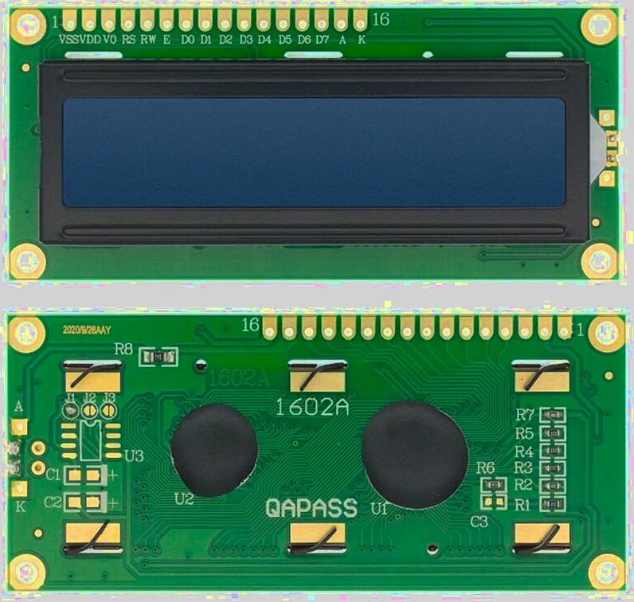
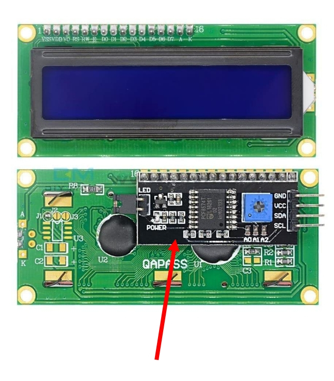

{{#title HD44780 LCD Display with I2C on Raspberry Pi Pico 2 in Embedded Rust}}

# LCD Display

In this section, we will work with Hitachi HD44780 compatible LCD (Liquid Crystal Display) modules. These character LCDs are extremely common and have been used for decades in everyday devices such as printers, digital clocks, microwaves, washing machines, air conditioners, and other home appliances. You will also find them in office equipment like copiers, fax machines, and network routers.

These displays are designed to show ASCII characters, and they also support up to 8 custom characters that you can define yourself.

## Variants

HD44780-compatible LCDs come in different physical formats. The most common ones are 16 × 2 displays, which have 16 columns and 2 rows, and 20 × 4 displays, which have 20 columns and 4 rows. They also differ in backlight color, such as blue, yellow, or green.

### LCD Interfaces

HD44780-based LCDs are typically used in one of two ways. The difference is not in the display itself, but in how control signals reach the controller.

At its core, the HD44780 controller uses a parallel interface. This is the native and most direct way to communicate with the LCD. Many modules expose this interface directly through their 16-pin header.

To simplify wiring, some modules include an I2C adapter board. This adapter sits between the microcontroller and the LCD and converts I2C commands into the same parallel signals expected by the HD44780 controller.

### Parallel Interface

When we use the parallel interface, we connect multiple GPIO pins from the microcontroller directly to the LCD. These pins carry control signals and data lines, along with power and contrast control.

This approach requires more wiring and uses many GPIO pins, but it closely reflects how the HD44780 controller operates internally. It is useful for understanding the timing, commands, and low-level behavior of the display.

### I2C Interface

There are variants that include an I2C adapter mounted on the back, and you can also add one later if needed.

With an I2C adapter, communication happens over just two signal lines. This reduces the number of required connections and makes wiring much simpler. Most I2C adapters include an inbuilt potentiometer for contrast control. Because of this, we do not need an external potentiometer or resistors when using the I2C variant.

The I2C variant is slightly more expensive (obviously) than the parallel version, but it remains affordable and widely available.

## In This Book

In this book, we will be using the I2C version. Originally, I was using the parallel interface because I did not know what to buy. However, the wiring quickly became difficult. I had to connect around 12 wires, whereas the I2C version requires only 4 wires.

There is also additional overhead when using the parallel interface, such as setting up a potentiometer or a voltage divider circuit to control the contrast. With the I2C version, this extra setup is not required.

## Hardware Requirements

We will need an LCD1602 display. A 16 × 2 module with an I2C adapter is recommended so you can follow along without adjustments, although other sizes behave the same way.

### Level Shifter

Pico GPIO pins are 3.3 V tolerant, which means they are not safe to use with 5 V signals. Applying a higher voltage, such as 5 V, to these pins can damage the board. Many LCD1602 displays with an I2C adapter are designed to operate at 5 V, which creates a voltage mismatch when connecting them directly to the Pico.

To connect the Pico and the LCD safely, we need to handle this voltage difference. This is where a level shifter is used. A bidirectional I2C logic level shifter allows 3.3 V and 5 V devices to communicate safely and protects the Pico GPIO pins. These modules are inexpensive and are commonly sold as "4 Channel (I2C) 3.3 V-5 V Bi-Directional Logic Level Converter".

Alternatively, you can power the LCD with 3.3 V. This avoids the voltage issue, but the display backlight and contrast will be noticeably dimmer.

## Datasheet

- You can access the datasheet for the HD44780 from [Sparkfun](https://www.sparkfun.com/datasheets/LCD/HD44780.pdf) or [MIT site](https://academy.cba.mit.edu/classes/output_devices/44780.pdf)
- [LCD Driver Data Book](https://www.crystalfontz.com/controllers/datasheet-viewer.php?id=433)
- [LCD Module 1602A Datasheet](https://www.openhacks.com/uploadsproductos/eone-1602a1.pdf)
