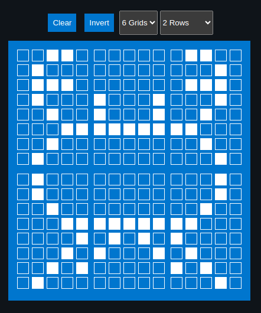

{{#title Multi-Byte Pixel Rows in embedded-graphics for OLED on Raspberry Pi Pico 2}}

# Multi-Cell Custom Glyph

In this section, we create Ferris using six adjacent grids with the generator from the previous page. Below is the Rust code that uses the generated byte arrays to render the glyph on the LCD.



We will focus only on the glyph composition here. Project setup and LCD initialization remain the same as before and are not repeated in this section.

### Generated Byte array for the characters

```rust
const SYMBOL1: [u8; 8] = [
    0b00110, 0b01000, 0b01110, 0b01000, 0b00100, 0b00011, 0b00100, 0b01000,
];

const SYMBOL2: [u8; 8] = [
    0b00000, 0b00000, 0b00000, 0b10001, 0b10001, 0b11111, 0b00000, 0b00000,
];

const SYMBOL3: [u8; 8] = [
    0b01100, 0b00010, 0b01110, 0b00010, 0b00100, 0b11000, 0b00100, 0b00010,
];

const SYMBOL4: [u8; 8] = [
    0b01000, 0b01000, 0b00100, 0b00011, 0b00001, 0b00010, 0b00101, 0b01000,
];

const SYMBOL5: [u8; 8] = [
    0b00000, 0b00000, 0b00000, 0b11111, 0b01010, 0b10001, 0b00000, 0b00000,
];

const SYMBOL6: [u8; 8] = [
    0b00010, 0b00010, 0b00100, 0b11000, 0b10000, 0b01000, 0b10100, 0b00010,
];
```

### Declare them as character

Each glyph is stored in a separate CGRAM slot. We use slots 0 through 5 for this example.

```rust
lcd.custom_char(&mut Delay, &SYMBOL1, 0);
lcd.custom_char(&mut Delay, &SYMBOL2, 1);
lcd.custom_char(&mut Delay, &SYMBOL3, 2);
lcd.custom_char(&mut Delay, &SYMBOL4, 3);
lcd.custom_char(&mut Delay, &SYMBOL5, 4);
lcd.custom_char(&mut Delay, &SYMBOL6, 5);
```

### Display

We write the first three glyphs on the first row, followed by the remaining three glyphs on the second row, aligning them to form a single composite symbol.

```rust
lcd.set_cursor(&mut Delay, 0, 4)
    .write(&mut Delay, CustomChar(0))
    .write(&mut Delay, CustomChar(1))
    .write(&mut Delay, CustomChar(2));

lcd.set_cursor(&mut Delay, 1, 4)
    .write(&mut Delay, CustomChar(3))
    .write(&mut Delay, CustomChar(4))
    .write(&mut Delay, CustomChar(5));
```

## Clone the existing project

You can clone (or refer) project I created and navigate to the `mutli-glyph` folder.

```sh
git clone https://github.com/ImplFerris/pico2-embassy-projects
cd pico2-embassy-projects/lcd/mutli-glyph/
```

## rp-hal version

A version using rp-hal is also available:

```sh
git clone https://github.com/ImplFerris/pico2-rp-projects
cd pico2-projects/lcd/mutli-glyph/
```
