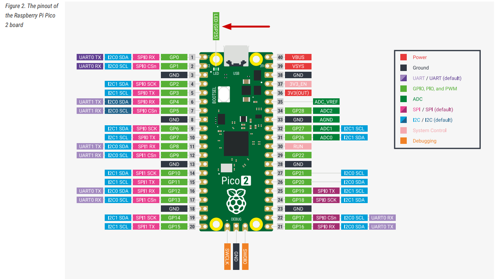
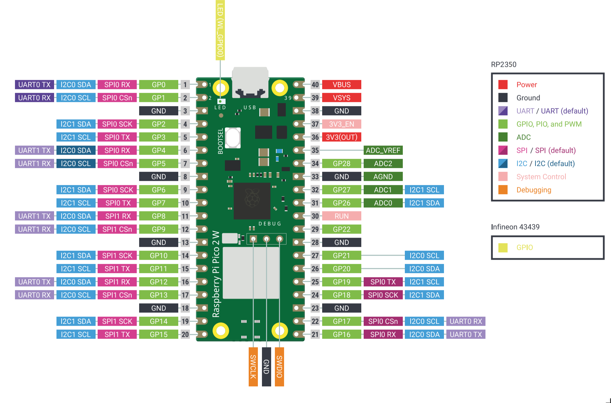

# 引脚图
> [!TIP]
> 你现在不需要记住或理解每一个引脚。用到的时候随时回顾即可

## “树莓派 Pico 2 引脚图”

## “树莓派 Pico 2 W 引脚图”

## 2W和2的区别

Pico 2 W 并不是只在 Pico 2 上“多焊了一个 Wi-Fi/蓝牙模块”。它的排针位置和大部分可用 GPIO 与 Pico 2 保持兼容，但板载 LED、电源状态检测、电源模式控制，以及部分内部 GPIO 的用途都发生了变化。下面每个差异点都标出了官方资料中提到的位置，方便你继续核对。

| 差异点 | Pico 2 | Pico 2 W | 为什么重要 | 出处 |
|---|---|---|---|---|
| 无线芯片和天线 | 没有板载无线接口 | 板载 Infineon CYW43439，支持 2.4 GHz Wi-Fi 4、Bluetooth 5.2，并使用板载天线 | Pico 2 W 可以直接做无线项目；天线区域附近不要放金属或其他会影响天线的结构 | [Pico 2 W Datasheet][pico2w-datasheet]：Chapter 1 “About Pico 2 W”、Chapter 2 “Mechanical specification”、Chapter 3.8 “Wireless interface” |
| 板载 LED | 用户 LED 连接到 RP2350 的 **GPIO25** | 用户 LED 连接到无线芯片的 **WL_GPIO0** | Pico 2 上可以直接控制 GPIO25 点亮板载 LED；Pico 2 W 上不能把 GPIO25 当作板载 LED 使用，需要通过 CYW43/WL_GPIO 控制 | [Pico 2 Datasheet][pico2-datasheet]：Chapter 3.1 “Raspberry Pi Pico 2 pinout”；[Pico 2 W Datasheet][pico2w-datasheet]：Chapter 2.1 “Pico 2 W pinout”；[pico-sdk `pico2.h`][pico-sdk-pico2] 中 `PICO_DEFAULT_LED_PIN`；[pico-sdk `pico2_w.h`][pico-sdk-pico2w] 中 `CYW43_WL_GPIO_LED_PIN` |
| VBUS 检测 | **GPIO24** 用于检测 USB VBUS 是否存在 | **WL_GPIO2** 用于检测 USB VBUS 是否存在 | 如果程序要判断当前是否 USB 供电，Pico 2 和 Pico 2 W 的读取方式不同 | [Pico 2 Datasheet][pico2-datasheet]：Chapter 3.1；[Pico 2 W Datasheet][pico2w-datasheet]：Chapter 2.1、Chapter 3.8；[pico-sdk `pico2.h`][pico-sdk-pico2] 中 `PICO_VBUS_PIN`；[pico-sdk `pico2_w.h`][pico-sdk-pico2w] 中 `CYW43_WL_GPIO_VBUS_PIN` |
| SMPS Power Save 控制 | **GPIO23** 控制板载 SMPS 的 Power Save 引脚 | **WL_GPIO1** 控制板载 SMPS 的 Power Save 引脚 | 如果为了降低 ADC 噪声而切换 SMPS 模式，Pico 2 直接控制 GPIO23；Pico 2 W 需要通过无线芯片 GPIO 控制 | [Pico 2 Datasheet][pico2-datasheet]：Chapter 3.1、Chapter 5.4 “Powerchain”；[Pico 2 W Datasheet][pico2w-datasheet]：Chapter 2.1、Chapter 3.3 “Using the ADC”、Chapter 3.4 “Powerchain”；[pico-sdk `pico2.h`][pico-sdk-pico2] 中 `PICO_SMPS_MODE_PIN`；[pico-sdk `pico2_w.h`][pico-sdk-pico2w] 中 `CYW43_WL_GPIO_SMPS_PIN` |
| RP2350 内部占用的 GPIO | GPIO23、GPIO24、GPIO25、GPIO29 分别用于 SMPS、VBUS、LED、VSYS/3 测量 | GPIO23、GPIO24、GPIO25、GPIO29 主要用于无线芯片接口：无线电源、SPI 数据/IRQ、SPI CS、SPI CLK/VSYS 测量 | 排针上仍然暴露 26 个 GPIO，但板内这些 GPIO 的默认职责不同；移植底层代码时要特别注意 | [Pico 2 Datasheet][pico2-datasheet]：Chapter 3.1；[Pico 2 W Datasheet][pico2w-datasheet]：Chapter 2.1；[pico-sdk `pico2_w.h`][pico-sdk-pico2w] 中 `CYW43_DEFAULT_PIN_WL_*` |
| VSYS 电压测量 | **GPIO29 / ADC3** 直接用于测量 VSYS/3 | **GPIO29 / ADC3** 与无线 SPI clock 复用，只适合在没有无线 SPI 事务时读取 | Pico 2 W 上测电池电压或 VSYS 时，要避开无线通信正在使用该引脚的时刻 | [Pico 2 Datasheet][pico2-datasheet]：Chapter 3.1；[Pico 2 W Datasheet][pico2w-datasheet]：Chapter 2.1、Chapter 3.4、Chapter 3.8；[pico-sdk `pico2_w.h`][pico-sdk-pico2w] 中 `CYW43_USES_VSYS_PIN` 和 `PICO_VSYS_PIN` |
| 机械布局和天线避让 | 51 mm x 21 mm x 1 mm，micro USB 位于顶部边缘 | 同样是 51 mm x 21 mm x 1 mm，但底边有板载无线天线，并要求天线区域不要被材料侵入 | 做外壳、底板或把 Pico 2 W 当作贴片模块使用时，要给天线留空间 | [Pico 2 Datasheet][pico2-datasheet]：Chapter 3 “Mechanical specification”；[Pico 2 W Datasheet][pico2w-datasheet]：Chapter 2 “Mechanical specification”、Chapter 3.8 |
| 推荐工作温度表 | Operating Temp Max 为 **85°C**（including self-heating），并建议环境温度最高 70°C | Operating Temp Max 为 **70°C**（including self-heating），并建议环境温度最高 70°C | 高温环境下，Pico 2 W 的无线芯片和整板热设计需要更保守 | [Pico 2 Datasheet][pico2-datasheet]：Chapter 3.3 “Recommended operating conditions”；[Pico 2 W Datasheet][pico2w-datasheet]：Chapter 2.3 “Recommended operating conditions” |
| 测试点 | 有 TP1 到 TP7，其中 TP7 是 1V1，不建议外部使用 | 有 TP1 到 TP6，没有 TP7；TP4/TP5 分别关联 WL_GPIO1/SMPS PS 和 WL_GPIO0/LED | 如果把 Pico 当作表贴模块，底部测试点用途不完全相同 | [Pico 2 Datasheet][pico2-datasheet]：Chapter 3.1；[Pico 2 W Datasheet][pico2w-datasheet]：Chapter 2.1 |
| 板载电源芯片 | Powerchain 图中使用 RT6150 buck-boost SMPS | Powerchain 图中使用 RT6154 buck-boost SMPS | 对普通接线来说，VBUS、VSYS、3V3_EN、3V3 的用法基本一致；但做更底层的电源分析时芯片型号不同 | [Pico 2 Datasheet][pico2-datasheet]：Chapter 5.4 “Powerchain”；[Pico 2 W Datasheet][pico2w-datasheet]：Chapter 3.4 “Powerchain” |

[pico2-datasheet]: https://datasheets.raspberrypi.com/pico/pico-2-datasheet.pdf
[pico2w-datasheet]: https://datasheets.raspberrypi.com/picow/pico-2-w-datasheet.pdf
[pico-sdk-pico2]: https://github.com/raspberrypi/pico-sdk/blob/master/src/boards/include/boards/pico2.h
[pico-sdk-pico2w]: https://github.com/raspberrypi/pico-sdk/blob/master/src/boards/include/boards/pico2_w.h

> [!NOTE]
> 后续的电源、GPIO、I2C、SPI、UART、SWD 等排针说明同时适用于 Pico 2 和 Pico 2 W。涉及板载 LED、VBUS/VSYS 读取、SMPS 模式控制时，以本节差异表为准。

## 电源引脚
Raspberry Pi Pico 2 / Pico 2 W 具有以下电源引脚。
引脚在引脚图中以红色（电源）和黑色（地线）标出，用于为主板及外部组件供电。

- **VBUS** 连接到来自 USB 端口的 5 V 电压。当主板通过 USB 供电时，该引脚将提供约 5 V 的电压。您可以使用它来驱动小型外部电路，但不适合高电流负载。

- **VSYS** 是主板的主要电源输入端口。您可以在该端口连接电池或稳压电源，输入电压范围为 1.8 V 至 5.5 V。此引脚为主板上的一个3.3V稳压器供电，进而为 RP2350 芯片及其他部件提供电力。

- **3V3(OUT)** 提供来自板载稳压器的稳定输出电压：3.3 V。可用于给外部设备如传感器或显示屏等元件供电，但建议限制电流不超过 300 mA。

- **GND** 引脚用于完成电气回路，并与系统接地相连。Pico 2 / Pico 2 W 在整个开发板上分布多个 GND 引脚，方便连接外部设备。

## GPIO引脚
Raspberry Pi Pico 2 和 Pico 2 W 的主排针都引出了 26 个 RP2350 通用输入/输出（GPIO）引脚：GPIO0 到 GPIO22，以及 GPIO26 到 GPIO28。GPIO23、GPIO24、GPIO25 和 GPIO29 没有作为普通排针 GPIO 引出，而是用于板载功能；其中 Pico 2 和 Pico 2 W 的具体用途不同，见上面的差异表。

这些 GPIO 引脚非常灵活，可用于读取开关或传感器等输入信号，也可用于控制 LED、电机或其他设备等输出。所有排针 GPIO 均以 3.3 V 的逻辑电平工作。这意味着你连接的任何输入信号电压都不应超过 3.3 V，否则可能损坏电路板。除了基本的数字输入/输出功能，部分引脚还支持模拟输入（ADC），或者作为 I²C、SPI、UART 等协议的通信线路使用。

### 引脚编号

每个 GPIO 引脚都可以通过两种方式来引用：
- 一种是使用其 GPIO 编号（在软件中使用）；
- 另一种是使用其在电路板上的物理引脚位置。

在编写代码时，你需要使用 GPIO 编号（例如 GPIO0）；而在连接导线时，则需要知道哪个 GPIO 引脚对应于电路板上的哪个物理引脚。

## ADC 引脚
Pico 2 / Pico 2 W 上的大多数 GPIO 都是数字引脚，只能读取或输出高电平、低电平这样的离散状态。但有些设备，比如光敏传感器、温度传感器，会输出逐渐变化的电压。为了读取这种模拟信号，我们需要使用一种特殊的引脚：ADC 引脚。

**ADC** 是 **Analog-to-Digital Converter** 的缩写，意思是“模数转换器”。它会把输入电压转换成程序可以理解的数字。例如，0 V 可能会被转换成 0，而 3.3 V 可能会被转换成 4095（因为 ADC 使用 12 位分辨率，4095 是它能表示的最大值）。

Raspberry Pi Pico 2 / Pico 2 W 的排针上都有三个可以作为 ADC 使用的引脚：GPIO26、GPIO27 和 GPIO28。它们分别对应 ADC0、ADC1 和 ADC2。你可以用这些引脚读取光敏传感器、温度传感器等设备输出的模拟信号。

另外，RP2350 还有一个 ADC3 通道。在 Pico 2 上，GPIO29/ADC3 用来测量 VSYS/3；在 Pico 2 W 上，GPIO29/ADC3 还与无线芯片的 SPI clock 复用，所以读取 VSYS 时要避开无线 SPI 正在通信的时刻。这个引脚不是普通排针 ADC 引脚，初学时通常先使用 GPIO26、GPIO27、GPIO28。

还有两个和模拟读取有关的特殊引脚：

- **ADC_VREF** 是 ADC 的参考电压。默认情况下，它连接到 3.3 V，这意味着 ADC 会把 0 V 到 3.3 V 之间的输入电压转换成数字。如果你希望在更小的电压范围内获得更高精度，也可以给这个引脚提供不同的参考电压，例如 1.25 V。

- **AGND** 是模拟地，用于给模拟信号提供更干净的地参考。这样可以减少噪声，让模拟读取结果更稳定。如果你正在连接模拟传感器，通常建议把传感器的 GND 接到 AGND，而不是普通的 GND 引脚。

## I2C 引脚

Raspberry Pi Pico 2 / Pico 2 W 支持 I2C。I2C 是一种常见的通信协议，只需要两根信号线就可以连接多个设备，常用于传感器、显示屏和其他外设。

I2C 使用两个信号：**SDA**（数据线）和 **SCL**（时钟线）。所有连接到同一条 I2C 总线上的设备都会共享这两根线。每个设备都有自己的地址，所以 Pico 2 / Pico 2 W 可以通过同一组 SDA/SCL 与多个设备通信。

Raspberry Pi Pico 2 / Pico 2 W 有两个 I2C 控制器：I2C0 和 I2C1。每个控制器都可以映射到多组 GPIO 引脚上，因此你可以根据电路布局灵活选择合适的引脚组合。

- **I2C0** 可以使用以下 GPIO：
  - SDA（数据）：GPIO0、GPIO4、GPIO8、GPIO12、GPIO16 或 GPIO20
  - SCL（时钟）：GPIO1、GPIO5、GPIO9、GPIO13、GPIO17 或 GPIO21

- **I2C1** 可以使用以下 GPIO：
  - SDA（数据）：GPIO2、GPIO6、GPIO10、GPIO14、GPIO18 或 GPIO26
  - SCL（时钟）：GPIO3、GPIO7、GPIO11、GPIO15、GPIO19 或 GPIO27

你可以从同一个控制器中选择一组匹配的 SDA 和 SCL 引脚。例如，如果选择 I2C0，就应该从 I2C0 的 SDA/SCL 列表中各选一个对应组合。

## SPI 引脚

SPI（Serial Peripheral Interface，串行外设接口）也是一种常见的通信协议，常用于连接显示屏、SD 卡、传感器等设备。和 I2C 相比，SPI 需要更多信号线，但通常可以提供更高的通信速度。SPI 通常由一个控制器（例如 Pico 2 / Pico 2 W）连接一个或多个外设。

SPI 使用四个主要信号：

- **SCK**（Serial Clock）：串行时钟，用于控制数据传输的时序。
- **MOSI**（Master Out Slave In）：控制器发送给外设的数据线。
- **MISO**（Master In Slave Out）：外设发送给控制器的数据线。
- **CS/SS**（Chip Select / Slave Select）：片选信号，用于选择当前要通信的外设。

在 Pico 2 / Pico 2 W 的引脚图中，MOSI 通常标为 **Tx**，MISO 标为 **Rx**，CS 标为 **Csn**。

Raspberry Pi Pico 2 / Pico 2 W 有两个 SPI 控制器：SPI0 和 SPI1。每个控制器都可以连接到多组 GPIO 引脚，因此你可以根据电路布局选择合适的一组。

- **SPI0** 可以使用：
  - SCK：GPIO2、GPIO6、GPIO10、GPIO14、GPIO18
  - MOSI：GPIO3、GPIO7、GPIO11、GPIO15、GPIO19
  - MISO：GPIO0、GPIO4、GPIO8、GPIO12、GPIO16

- **SPI1** 可以使用：
  - SCK：GPIO14、GPIO18
  - MOSI：GPIO15、GPIO19
  - MISO：GPIO8、GPIO12、GPIO16

你可以根据电路布局，从同一个 SPI 控制器中选择一组兼容的引脚。CS（片选）引脚不是固定的，可以使用任意空闲 GPIO。后续章节会继续介绍如何配置 SPI 并连接外设。

## UART 引脚

UART（Universal Asynchronous Receiver/Transmitter，通用异步收发器）是让两个设备通信的简单方式之一。它主要使用两根线：

- **TX**（Transmit）：发送数据。
- **RX**（Receive）：接收数据。

UART 常用于连接串口设备，例如 GPS 模块、蓝牙串口模块，也可以用于把调试信息发送到电脑。

Raspberry Pi Pico 2 / Pico 2 W 有两个 UART 控制器：**UART0** 和 **UART1**。每个控制器都可以映射到几组不同的 GPIO 引脚上，因此接线时比较灵活。

- **UART0** 可以使用：
  - TX：GPIO0、GPIO12、GPIO16
  - RX：GPIO1、GPIO13、GPIO17

- **UART1** 可以使用：
  - TX：GPIO4、GPIO8
  - RX：GPIO5、GPIO9

你需要使用同一个 UART 控制器中的一组 TX 和 RX 引脚。例如，可以使用 UART0 的 GPIO0 作为 TX、GPIO1 作为 RX；也可以使用 UART1 的 GPIO8 作为 TX、GPIO9 作为 RX。

## SWD 调试引脚

Raspberry Pi Pico 2 / Pico 2 W 提供了专用的 3 针 SWD 调试接口。SWD 是 Serial Wire Debug 的缩写，是 Arm 常用的调试接口。通过 SWD，你可以烧录固件、查看寄存器、设置断点，并对正在运行的程序进行实时调试。

这个接口包含以下信号：

- **SWDIO**：串行数据线
- **SWCLK**：串行时钟线
- **GND**：地参考

这些引脚不会和通用 GPIO 共用，它们位于开发板底部边缘的独立调试排针上。通常你会使用外部调试器来连接这些引脚，例如 Raspberry Pi Debug Probe、CMSIS-DAP 适配器，或其他兼容工具（例如 OpenOCD、probe-rs）。

## 板载温度传感器

Raspberry Pi Pico 2 / Pico 2 W 使用的 RP2350 内部包含一个温度传感器，它连接到 **ADC4**。这意味着你可以像读取外部模拟传感器一样，通过 ADC 读取芯片温度。

这个温度传感器测量的是 RP2350 芯片自身的温度。它不能准确代表室温，尤其是在芯片负载较高、开始发热的时候。

## 控制引脚

这些引脚用于控制开发板的电源行为，可以用来复位芯片或关闭芯片供电。

- **3V3(EN)** 是板载 3.3 V 稳压器的使能引脚。把这个引脚拉低会关闭 3.3 V 电源轨，从而让 RP2350 断电。

- **RUN** 是 RP2350 的复位引脚。它内部带有上拉电阻，默认保持高电平。把它拉低会复位微控制器。如果你想添加一个物理复位按钮，或者让其他设备触发 Pico 2 / Pico 2 W 复位，这个引脚就很有用。
