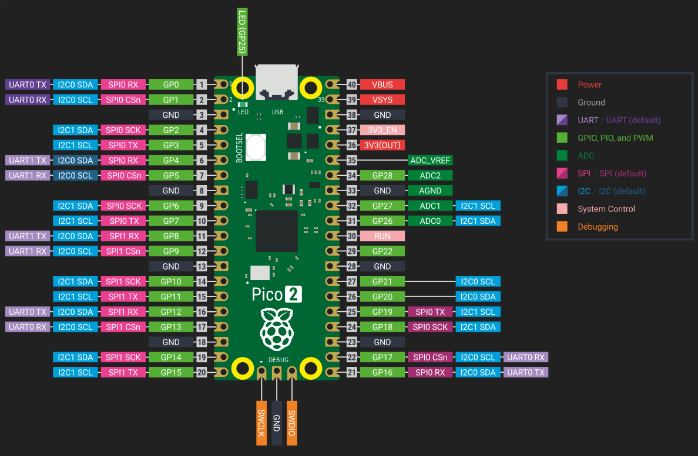

{{#title SPI Peripheral Setup on Raspberry Pi Pico 2 with Embassy and rp-hal}}

# RP2350 SPI Peripherals

The RP2350 includes two SPI controllers, named SPI0 and SPI1. Both are general purpose peripherals and are available for application use. These controllers provide flexible serial communication capabilities for connecting external devices like sensors, displays, SD cards, and other SPI peripherals.

Each SPI peripheral supports standard SPI operation, including master and slave modes, full-duplex transfers, and the usual SPI signals: SCLK, MOSI, MISO, and chip select.

You can refer to the 1046th page on the RP2350 datasheet for more detailed and accurate information: https://pip-assets.raspberrypi.com/categories/1214-rp2350/documents/RP-008373-DS-2-rp2350-datasheet.pdf?disposition=inline#page=1047

## GPIO Pins

The Raspberry Pi Pico 2 exposes two SPI buses on its GPIO header: SPI0 and SPI1. Each SPI bus uses four signals: clock (SCK), transmit (MOSI), receive (MISO), and chip select (CS).



In the above diagram, the SPI pins are highlighted in pink.

### SPI0 pin options

| MISO (RX) | CS      | SCK     | MOSI (TX) |
| --------- | ------- | ------- | --------- |
| GPIO 0    | GPIO 1  | GPIO 2  | GPIO 3    |
| GPIO 4    | GPIO 5  | GPIO 6  | GPIO 7    |
| GPIO 16   | GPIO 17 | GPIO 18 | GPIO 19   |

### SPI1 pin options

| MISO (RX) | CS      | SCK     | MOSI (TX) |
| --------- | ------- | ------- | --------- |
| GPIO 8    | GPIO 9  | GPIO 10 | GPIO 11   |
| GPIO 12   | GPIO 13 | GPIO 14 | GPIO 15   |

## Using SPI in embassy

Embassy provides two ways to use SPI. One is async, where transfers can be awaited without blocking the executor. The other is blocking, which behaves more like traditional HALs and is often simpler for small examples or one-off transfers.

### Async mode

In async mode, SPI uses DMA under the hood. You must provide DMA channels, and all transfers are performed using `.await`. This is useful when SPI transfers are part of a larger async application and you do not want to block other tasks.

```rust
let miso = p.PIN_12;
let mosi = p.PIN_11;
let clk = p.PIN_10;

let mut spi_bus = Spi::new(p.SPI1, clk, mosi, miso, p.DMA_CH0, p.DMA_CH1, spi::Config::default());

let tx_buf = [1_u8, 2, 3, 4, 5, 6];
let mut rx_buf = [0_u8; 6];
spi_bus.transfer(&mut rx_buf, &tx_buf).await.unwrap();
info!("{:?}", rx_buf);
```

Here, data is written from tx_buf while data received from the peripheral is stored in rx_buf. The call to transfer only returns once the SPI transaction is complete.

### Blocking mode

Blocking SPI is simpler, calls return only after the transfer is finished, and no DMA or async context is required.

```rust
let miso = p.PIN_12;
let mosi = p.PIN_11;
let clk = p.PIN_10;

let mut config = spi::Config::default();
let mut spi_bus = Spi::new_blocking(p.SPI1, clk, mosi, miso, config);

spi_bus.blocking_transfer_in_place(&mut buf).unwrap();
```

## Using SPI in rp-hal

In the rp-hal SPI, you need to first configure the pins into SPI function mode, then the SPI peripheral is created and initialized with the desired clock speed and SPI mode.

```rust
 // These are implicitly used by the spi driver if they are in the correct mode
let spi_mosi = pins.gpio7.into_function::<hal::gpio::FunctionSpi>();
let spi_miso = pins.gpio4.into_function::<hal::gpio::FunctionSpi>();
let spi_sclk = pins.gpio6.into_function::<hal::gpio::FunctionSpi>();
let spi_bus = hal::spi::Spi::<_, _, _, 8>::new(pac.SPI0, (spi_mosi, spi_miso, spi_sclk));

// Exchange the uninitialised SPI driver for an initialised one
let mut spi_bus = spi_bus.init(
    &mut pac.RESETS,
    clocks.peripheral_clock.freq(),
    16.MHz(),
    embedded_hal::spi::MODE_0,
);

// Write out 0, ignore return value
if spi_bus.write(&[0]).is_ok() {
    // SPI write was successful
};
```

## Example Driver Usage

Usually, you will not talk to SPI directly. Instead, you pass an SPI device to a driver. This usually means creating an SPI bus first, then wrapping it using `ExclusiveDevice` provided by the `embedded-hal-bus` crate.

```rust
let clk = p.PIN_14;
let mosi = p.PIN_15;

let spi_bus = Spi::new_blocking_txonly(p.SPI1, clk, mosi, SpiConfig::default());
let spi_dev = ExclusiveDevice::new_no_delay(spi_bus, cs_pin).expect("Failed to get exclusive device");

// Create a display instance for a single 8x8 LED matrix (not daisy-chained)
let mut display = SingleMatrix::from_spi(spi_dev).expect("display count 1 should not panic");
```
