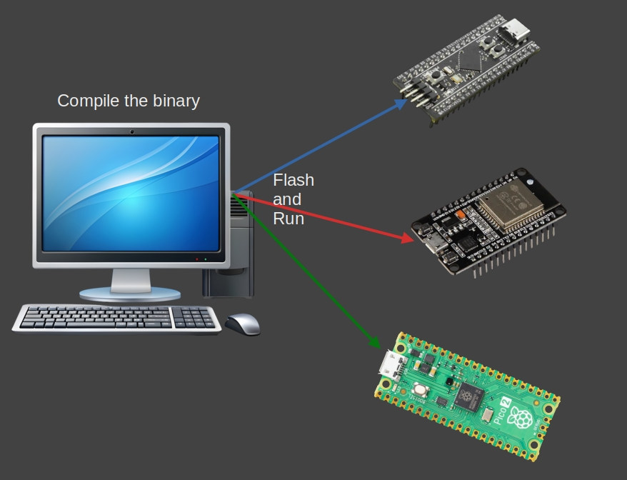

{{#title Cross Compilation for Embedded Rust and Raspberry Pi Pico 2 | impl Rust for RP2350}}

# Cross Compilation

You probably know about cross compilation already. In this section, we'll explore how this works and what it means to deal with things like target triples. In simple terms, cross compilation is building programs for different machine than the one you're using.

You can write code on one computer and make programs that run on totally different computers. For example, you can work on Linux and build .exe files for Windows. You can even target bare-metal microcontrollers like the RP2350, ESP32, or STM32.

> **TL;DR**
>
>We have to use either "thumbv8m.main-none-eabihf" or "riscv32imac-unknown-none-elf" as the target when building our binary for the Pico 2.
>
> `cargo build --target thumbv8m.main-none-eabihf`
>
> We can also configure the target in `.cargo/config.toml` so that we don't need to type it every time.



## Building for Your Host System

Let's say we are on a Linux machine. When you run the usual build command, Rust compiles your code for your current host platform, which in this case is Linux:

```sh
cargo build
```

You can confirm what kind of binary it just produced using the file command:

```sh
file ./target/debug/pico-from-scratch
```

This will give an output like the following. This tells you it is a 64-bit ELF binary, dynamically linked, and built for Linux.

```sh
./target/debug/pico-from-scratch: ELF 64-bit LSB pie executable, x86-64, version 1 (SYSV), dynamically linked, interpreter /lib64/ld-linux-x86-64.so.2, Build...
```

## Cross compiling for Windows

Now let's say you want to build a binary for Windows without leaving your Linux machine. That's where cross-compilation comes into play.

First, you need to tell Rust about the target platform. You only have to do this once:

```sh
rustup target add x86_64-pc-windows-gnu
```

This adds support for generating 64-bit Windows binaries using the GNU toolchain (MinGW).

Now build your project again, this time specifying the target:

```sh
cargo build --target x86_64-pc-windows-gnu
```

That's it. Rust will now create a Windows .exe binary, even though you're still on Linux. The output binary will be located at `target/x86_64-pc-windows-gnu/debug/pico-from-scratch.exe`

You can inspect the file type like this:

```sh
file target/x86_64-pc-windows-gnu/debug/pico-from-scratch.exe
```

It will give you output like this, a 64 bit PE32+ File format file for windows.

```sh
target/x86_64-pc-windows-gnu/debug/pico-from-scratch.exe: PE32+ executable (console) x86-64, for MS Windows
```

## What Is a Target Triple?

So what's this `x86_64-pc-windows-gnu` string all about?

That's what we call a target triple, and it tells the compiler exactly what kind of output you want. It usually follows this format:

```html
`<architecture>-<vendor>-<os>-<abi>`
```

But the pattern is not always consistent. Sometimes the ABI part won't be there. In other cases, even the vendor or both vendor and ABI might be absent. The structure can get messy, and there are plenty of exceptions. If you want to dive deeper into all the quirks and edge cases, check out the article "What the Hell Is a Target Triple?" linked in the references.

Let's break down what this target triple actually means:

- **Architecture (x86_64)**: This just means 64-bit x86, which is the type of CPU most modern PCs use. It's also called AMD64 or x64.

- **Vendor (pc)**: This is basically a placeholder. It's not very important in most cases. If it is for mac os, the vendor name will be "apple".

- **OS (windows)**: This tells Rust that we want to build something that runs on Windows.

- **ABI (gnu)**: This part tells Rust to use the GNU toolchain to build the binary.

## Reference

- [Platform Support](https://doc.rust-lang.org/beta/rustc/platform-support.html)
- [Cross-Compilation](https://rust-lang.github.io/rustup/cross-compilation.html)
- [What the Hell Is a Target Triple?](https://mcyoung.xyz/2025/04/14/target-triples/)
