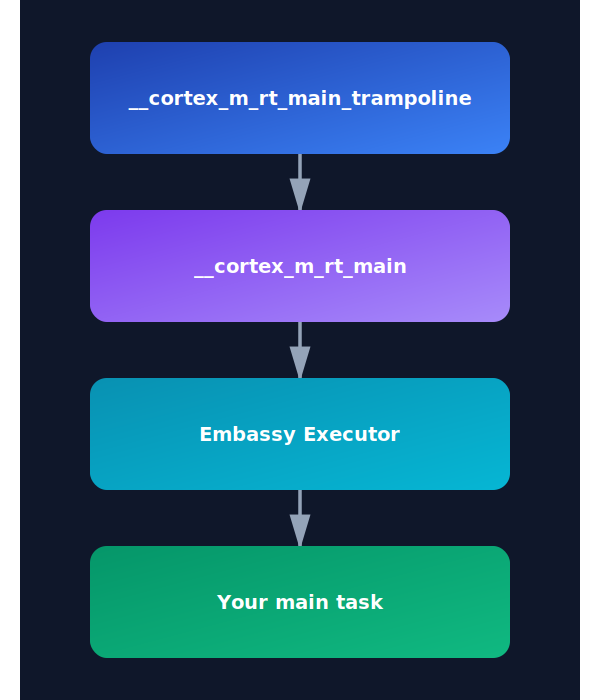

{{#title Understanding no_main and Entry Point in Embedded Rust for Raspberry Pi Pico 2}}

# no_main

When you try to build at this stage, you'll get an error saying the main function requires the standard library. What?! (I controlled my temptation to insert a Mr. Bean meme here since not everyone will like meme.) So what now? Where does the program even start?

In embedded systems, we don't use the regular `fn main` that relies on the standard library. Instead, we have to tell Rust that we'll bring our own entry point. For that, we use the `no_main` attribute.

The `#![no_main]` attribute is to indicate that the program won't use the standard entry point (`fn main`).

In the top of your `src/main.rs` file, add this line:

```rs
#![no_main]
```

## Declaring the Entry Point

Now that we've opted out of the default entry point, we need to tell Rust which function to start with. Each HAL crates in the embedded Rust ecosystem provides a special proc macro attribute that allows us to mark the entry point. This macro initializes and sets up everything needed for the microcontroller.

If we were using rp-hal, we could use `rp235x_hal::entry` for the RP2350 chip. However, we're going to use Embassy (the embassy-rp crate). Embassy provides the `embassy_executor::main` macro, which sets up the async runtime for tasks and calls our main function.

> The Embassy Executor is an async/await executor designed for embedded usage along with support functionality for interrupts and timers. You can read the official [Embassy book](https://embassy.dev/book) to understand in depth how Embassy works.

### Cortex-m Run Time

If you follow the [`embassy_executor::main`](https://github.com/embassy-rs/embassy/blob/2c1c5232e8767887cbad5f28abf9a39ae78dd6c4/embassy-executor-macros/src/lib.rs#L69) macro, you'll see it uses another macro depending on the architecture. Since the Pico 2 is Cortex-M, it uses `cortex_m_rt::entry`. This comes from the `cortex_m_rt` crate, which provides startup code and minimal runtime for Cortex-M microcontrollers.

<a href="./images/embassy-entry-point.svg"></a>

If you run `cargo expand` in the quick-start project, you can see how the macro expands and the full execution flow. If you follow the rabbit hole, the program starts at the `__cortex_m_rt_main_trampoline` function. This function calls `__cortex_m_rt_main`, which sets up the Embassy executor and runs our main function.

To make use of this, we need to add the `cortex-m` and `cortex-m-rt` crates to our project. Update the `Cargo.toml` file:

```toml
cortex-m = { version = "0.7.7" }
cortex-m-rt = "0.7.5"
```

Now, we can add the embassy executor crate:

```toml
embassy-executor = { version = "0.9", features = [
  "arch-cortex-m",
  "executor-thread",
] }
```

Then, in your `main.rs`, set up the entry point like this:

```rust
use embassy_executor::Spawner;

#[embassy_executor::main]
async fn main(_spawner: Spawner) {}
```

We have changed the function signature. The function must accept a `Spawner` as its argument to satisfy embassy’s requirements, and the function is now marked as `async`.

## Are we there yet?

Hoorah! Now try building the project - it should compile successfully.

You can inspect the generated binary using the file command:

```sh
file target/thumbv8m.main-none-eabihf/debug/pico-from-scratch
```

It will show something like this:

```sh
target/thumbv8m.main-none-eabihf/debug/pico-from-scratch: ELF 32-bit LSB executable, ARM, EABI5 version 1 (GNU/Linux), statically linked, with debug_info, not stripped
```

As you can see, the binary is built for a 32-bit ARM. That means our base setup for Pico is working.

But are we there yet? Not quite. We've crossed half the stage - we now have a valid binary ready for Pico, but there's more to do before we can run it on real hardware.

**Resources:**

- [Rust official doc](https://doc.rust-lang.org/reference/crates-and-source-files.html?highlight=no_main#the-no_main-attribute)
- [Writing an OS in Rust Book](https://os.phil-opp.com/freestanding-rust-binary/#overwriting-the-entry-point)
