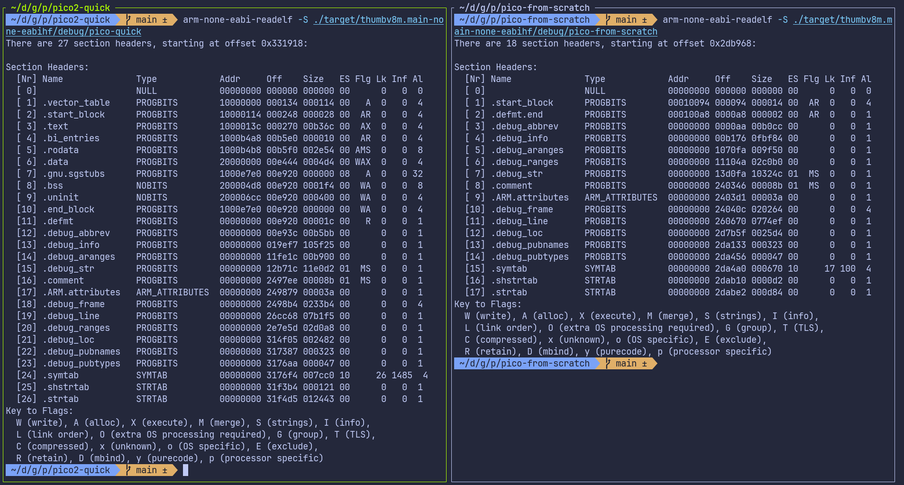
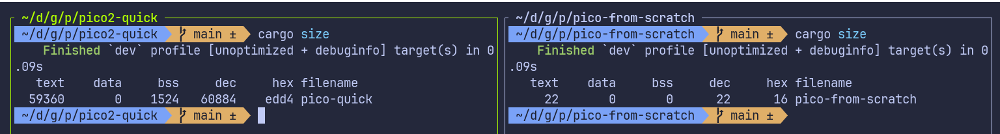

{{#title Linker Script and memory.x Setup for Embedded Rust on Raspberry Pi Pico 2}}

# Linker Script

The program now compiles successfully. However, when you attempt to flash it onto the Pico, you may encounter an error like the following:

```sh
ERROR: File to load contained an invalid memory range 0x00010000-0x000100aa
```

## Comparing our project with quick start project

To understand why flashing fails, let's inspect the compiled program using the `arm-none-eabi-readelf` tool. This tool shows how the compiler and linker organized the program in memory.

I took the binary from the quick-start project and compared it with the binary our project produces at its current state.

<div class="image-with-caption" style="text-align:center; display:inline-block;">
    
    <div class="caption" style="font-size:0.9em; color:#555; margin-top:6px;">Quick Start vs our project</div>
</div>

You don't need to understand every detail in this output. The important part is simply noticing that the two binaries look very different, even though our Rust code is almost the same.

The big difference is that our project is missing some important sections like `.text`, `.rodata`, `.data`, and `.bss`. These sections are normally created by the linker:

- `.text`: this is where the actual program instructions (the code) go
- `.rodata`: read-only data, such as constant values
- `.data`: initialized global or static variables
- `.bss`: uninitialized global or static variables

You can also use `cargo size` command provided by the [cargo-binutils](https://github.com/rust-embedded/cargo-binutils) toolset to compare them.

<div class="image-with-caption" style="text-align:center; display:inline-block;">
    
    <div class="caption" style="font-size:0.9em; color:#555; margin-top:6px;">cargo size: Quick Start vs our Project</div>
</div>

**Linker:**

This is usually taken care of by something called linker. The role of the linker is to take all the pieces of our program, like compiled code, library code, startup code, and data, and combine them into one final executable that the device can actually run. It also decides where each part of the program should be placed in memory, such as where the code goes and where global variables go.

However, the linker does not automatically know the memory layout of the RP2350. We have to tell it how the flash and RAM are arranged. This is done through a linker script. If the linker script is missing or incorrect, the linker will not place our code in the proper memory regions, which leads to the flashing error we are seeing.

### Linker Script

We are not going to write the linker script ourselves. The `cortex-m-rt` crate already provides the main linker script (`link.x`), but it only knows about the Cortex-M core. It does not know anything about the specific microcontroller we are using. Every microcontroller has its own flash size, RAM size, and memory layout, and `cortex-m-rt` cannot guess these values.

Because of this, `cortex-m-rt` expects the user or the board support crate to supply a small linker script called `memory.x`. This file describes the memory layout of the target device.

In `memory.x`, we must define the memory regions that the device has. At minimum, we need two regions: one named `FLASH` and one named `RAM`. The `.text` and `.rodata` sections of the program are placed in the `FLASH` region. The `.bss` and `.data` sections, along with the heap, are placed in the `RAM` region.

For the RP2350, the datasheet (chapter 2.2, Address map) specifies that flash starts at address `0x10000000` and SRAM starts at `0x20000000`. So our `memory.x` file will look something like this:

```text
MEMORY {
    FLASH : ORIGIN = 0x10000000, LENGTH = 2048K

    RAM : ORIGIN = 0x20000000, LENGTH = 512K
    SRAM4 : ORIGIN = 0x20080000, LENGTH = 4K
    SRAM5 : ORIGIN = 0x20081000, LENGTH = 4K
    ...
    ...
}
...
...
```

There are a few more settings required in `memory.x` for RP2350. We do not need to write those by hand. Instead, we will use the [file provided in the embassy-rp examples repository](https://github.com/embassy-rs/embassy/blob/a6d392b24c5f010a8b5b2a00326c04b05a4ab0f0/examples/rp235x/memory.x) and place it in the root of your project.

## Codegen Option for Linker

Putting the `memory.x` file in the project folder is not enough. We also need to make sure the linker actually uses the linker script provided by `cortex-m-rt`.

To fix this, we tell Cargo to pass the linker script `link.x` to the linker.  There are multiple ways we can pass the argument to the rust. we can use the method like `.cargo/config.toml` or build script `build.rs` file. In the quick start, we are using the `build.rs`. So this time we will use the `.cargo/config.toml` approach. In the file, update the target section with the following:

```toml
[target.thumbv8m.main-none-eabihf]
runner = "picotool load -u -v -x -t elf" # we alerady added this
rustflags = ["-C", "link-arg=-Tlink.x"]  # This is the new line
```

## Run Pico Run

With everything set up, you can now flash the program to the Pico:

```sh
cargo run --release
```

Phew... we took a normal Rust project, turned it into a `no_std` firmware for the Pico. Finally, we can now see the LED blinking.

## Resources

- [Everything You Never Wanted To Know About Linker Script](https://mcyoung.xyz/2021/06/01/linker-script/)
